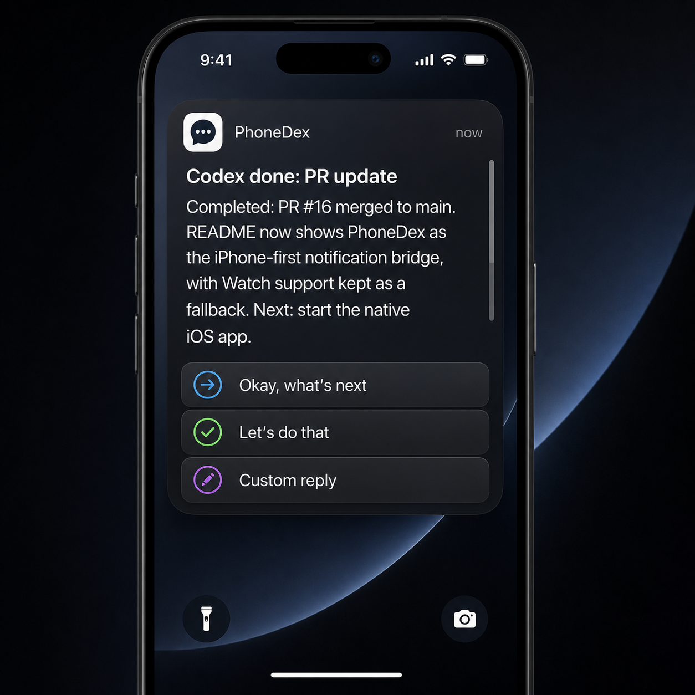

# PhoneDex

[](#requirements)
[](#delivery-rails)
[](#multi-device-hub)
[](#pushcut)

<p align="center">
  
</p>

<p align="center">
  <em>Get Codex completion alerts on iPhone, dictate the next reply, and keep the thread moving.</em>
</p>

PhoneDex sends completed Codex task alerts to your iPhone and records quick
replies or dictated responses from the phone notification.

It is a local bridge for people who start Codex work on one or more machines,
walk away, and still want a fast way to review the result and answer the next
obvious prompt: "Okay, what's next?", "Let's do that", or a custom reply.

## What It Does

- Installs a Codex `Stop` hook that fires when a Codex turn completes.
- Watches Codex session logs as a fallback when hooks miss a completed reply.
- Runs as a central hub plus lightweight agents on each Codex machine.
- Ingests completed Codex responses from every configured machine through
  `POST /tasks`.
- Sends actionable notifications through the native PhoneDex app path, with
  Pushcut available as an optional webhook fallback.
- Uses native expanded notification fields on iPhone for longer Codex output.
- Shows iPhone notification actions for:
  - `Okay, what's next`
  - `Let's do that`
  - a typed or dictated custom reply
- Routes replies back to the original Codex machine with per-notification
  `replyUrl` data.
- Can paste phone replies into the visible Codex desktop thread.
- Records replies in `data/replies.jsonl` so you have a local decision log.
- Can wrap any shell command and notify you when it finishes.
- Includes auto-resume modes for sending replies back to Codex.

PhoneDex is Mac-first and local-first. The new primary shape is one PhoneDex
hub that your iPhone talks to, plus one PhoneDex agent on every Mac or Windows
machine where you run Codex. Apple Watch support still exists as a secondary
surface, but iPhone is the primary reply path.

## Project Status

PhoneDex is currently a working local bridge plus native iOS prototype.

The branded scrollable UI lives in the native PhoneDex iOS app in
[ios/](ios/). Until native remote push is finished, the app can fetch recent
tasks from the hub and post replies back to PhoneDex; Pushcut can still be used
as a webhook delivery fallback.

The reliable path today is:

```text
Codex finishes work
  -> Codex Stop hook runs PhoneDex
  -> PhoneDex session watcher catches missed Stop hooks
  -> local PhoneDex agent stores the task and forwards it to the hub
  -> PhoneDex hub stores every configured machine's tasks
  -> PhoneDex hub sends or exposes the iPhone notification
  -> you type or dictate a reply
  -> iPhone calls PhoneDex /reply
  -> hub records the reply and routes it back to the originating machine
  -> optional auto-resume starts a Codex turn on that machine
```

Auto-continuing Codex from a phone reply is off by default. When enabled,
`app-server` mode uses Codex's local app-server protocol to resume the recorded
session and submit the phone reply as a new turn. `Okay, what's next` is wrapped
as a status-only prompt so it does not start new background work; `Let's do
that` is the action-oriented reply.

If you want the phone reply to appear in the currently open Codex desktop
thread, use `foreground` mode. It activates Codex.app, pastes the literal phone
reply text into the visible input, and submits it through the UI. macOS must allow the
process running PhoneDex, plus `osascript` when prompted, to control the
computer in **Privacy & Security > Accessibility**.

## Requirements

- macOS for the hub and native iOS build flow; Node-based agents can run on
  other Codex machines, including Windows, when they can read that machine's
  local Codex session files.
- Node.js 18 or newer
- Codex desktop app with hooks enabled
- iPhone with the native PhoneDex app installed for the app UI
- Optional Pushcut webhook delivery if you already use it

No npm package dependencies are required for the bridge itself.

## Quick Start

Clone the repo, then from the project root:

```sh
git clone https://github.com/nash226/phonedex.git
cd phonedex
npm run check
node ./bin/codex-watch.js setup
npm run install-hook
```

Edit `.env` for the hub machine. This is the Mac the iPhone app should connect
to:

```sh
WATCH_BRIDGE_PUBLIC_URL=http://YOUR_MAC_LAN_IP:8765
WATCH_BRIDGE_HOST=0.0.0.0
PHONEDEX_MACHINE_NAME=MacBook Air
PHONEDEX_DEVICE_ID=macbook-air
PHONEDEX_EXPECTED_DEVICES=macbook-air:MacBook Air,windows-desktop:Windows Desktop
```

Start the PhoneDex service:

```sh
npm run service
```

In Codex, open `/hooks`, review the `PhoneDex` hook, and trust it. Codex
requires approval before changed user hooks are allowed to run.

Send a test notification:

```sh
npm run test-notify
```

Read replies:

```sh
npm run replies
```

On every other Codex machine, install PhoneDex with the same hook and session
watcher, then point it at the hub:

```sh
PHONEDEX_HUB_URL=http://YOUR_HUB_MAC_LAN_IP:8765
PHONEDEX_HUB_TOKEN=THE_HUB_WATCH_BRIDGE_TOKEN
PHONEDEX_AGENT_MODE=true
WATCH_BRIDGE_PUBLIC_URL=http://THIS_MACHINE_CALLBACK_URL:8765
WATCH_BRIDGE_HOST=0.0.0.0
PHONEDEX_MACHINE_NAME=Windows Desktop
PHONEDEX_DEVICE_ID=windows-desktop
```

Generate a ready-to-paste agent block from the hub with:

```sh
npm run agent:enroll -- --device-id macbook-air --name "MacBook Air" --platform macos --callback-url http://MACBOOK_AIR_LAN_IP:8765
npm run agent:enroll -- --device-id windows-desktop --name "Windows Desktop" --platform windows --callback-url http://WINDOWS_LAN_IP:8765
```

The command prints the target device `.env`, the target install commands, and
the hub `PHONEDEX_EXPECTED_DEVICES` value to use before running
`npm run devices:verify`. When enrolling multiple agents, merge those generated
hub values into one comma-separated `PHONEDEX_EXPECTED_DEVICES` line that
includes the hub plus every Mac and Windows agent you expect to report.

On macOS agents, start `npm run service` directly or install the LaunchAgent:

```sh
npm run services:install
```

On Windows agents, install the user-level Scheduled Task:

```powershell
npm run windows:install
```

The hub will receive forwarded completions at `POST /tasks` and live device
heartbeats at `POST /devices/heartbeat`; check coverage on the hub with:

```sh
npm run devices
npm run devices:verify
```

## Delivery Rails

| Rail | Cost | Best For | Notes |
| --- | --- | --- | --- |
| Native PhoneDex app | Free after local install | Branded iPhone UI, task fetching, and native replies | This is the target path. Remote push wakeup is still in progress. |
| Pushcut | Pushcut plan may be required for dynamic actions | Fast webhook fallback if you already use Pushcut | Dynamic notification fields and actions may require Pushcut Pro. |

## Multi-Device Hub

PhoneDex can now run as a hub-and-agent mesh:

- The hub stores every configured device's task stream in `data/tasks.jsonl`.
- Agents run on each Codex machine and forward local completion events to the
  hub's `POST /tasks` endpoint.
- The hub keeps origin metadata so a phone reply can route back to the machine
  and session that created the notification.
- `/devices` and `npm run devices` show which machines are online, stale,
  missing, or task-only.
- `npm run devices:verify` fails unless every id in `PHONEDEX_EXPECTED_DEVICES`
  is currently online. This is the hub's proof gate for account-wide coverage.

Hub `.env`:

```sh
WATCH_BRIDGE_HOST=0.0.0.0
WATCH_BRIDGE_PUBLIC_URL=http://YOUR_HUB_MAC_LAN_IP:8765
WATCH_BRIDGE_TOKEN=shared-secret
PHONEDEX_MACHINE_NAME=MacBook Air
PHONEDEX_DEVICE_ID=macbook-air
PHONEDEX_EXPECTED_DEVICES=macbook-air:MacBook Air,windows-desktop:Windows Desktop
```

Agent `.env` on another machine:

```sh
PHONEDEX_HUB_URL=http://YOUR_HUB_MAC_LAN_IP:8765
PHONEDEX_HUB_TOKEN=shared-secret
PHONEDEX_AGENT_MODE=true
WATCH_BRIDGE_HOST=0.0.0.0
WATCH_BRIDGE_PUBLIC_URL=http://THIS_MACHINE_LAN_IP:8765
WATCH_BRIDGE_TOKEN=this-machine-secret
PHONEDEX_MACHINE_NAME=Windows Desktop
PHONEDEX_DEVICE_ID=windows-desktop
```

On a Windows Codex agent:

```powershell
npm run install-hook
npm run windows:install
npm run windows:status
```

The Windows task is installed for the current user, starts at logon, runs
`node bin\codex-watch.js service`, and writes logs to
`.local\windows-service.log`. It requires Node.js on `PATH` for that Windows
user and the built-in Windows PowerShell ScheduledTasks module.

Each machine still needs local access to its own Codex session files. There is
not currently a public Codex account API that lets one Mac read every other
device's local thread responses by itself, so every device that should report
must run the PhoneDex hook and session watcher.

Device status meanings:

- `online`: the hub has received a recent heartbeat from this device.
- `stale`: the device was registered but has not heartbeated within
  `PHONEDEX_DEVICE_STALE_MS`.
- `missing`: the device is listed in `PHONEDEX_EXPECTED_DEVICES` but has never
  heartbeated or sent a task to this hub.
- `task-only`: the hub has task history for the device, but no service
  heartbeat yet.

Use `npm run devices:verify` on the hub after enrolling each machine. It exits
nonzero when `PHONEDEX_EXPECTED_DEVICES` is empty, or when any expected device
is `missing`, `stale`, or `task-only`. That means the hub is not yet in a state
where it can reliably receive future Codex completions from every listed
device.

For the full system design, see [docs/architecture.md](docs/architecture.md).
For the legacy native Apple Watch app scaffold, see [watchos/README.md](watchos/README.md).
For the native iOS notification UI prototype, see [ios/README.md](ios/README.md).

## Pushcut

Create a Pushcut notification, copy its webhook URL, and configure:

```sh
WATCH_BRIDGE_PROVIDER=pushcut
PUSHCUT_WEBHOOK_URL=https://api.pushcut.io/YOUR_SECRET/notifications/codex-task
WATCH_BRIDGE_PUBLIC_URL=http://YOUR_MAC_LAN_IP:8765
WATCH_BRIDGE_HOST=0.0.0.0
```

PhoneDex sends dynamic `title`, `text`, and `actions` fields in the Pushcut
JSON body. Each action performs a background web request to:

```text
${WATCH_BRIDGE_PUBLIC_URL}/reply
```

`WATCH_BRIDGE_TOKEN` is included in the query string and request body so random
callers cannot record replies.

## Commands

| Command | Purpose |
| --- | --- |
| `npm run check` | Syntax-check the PhoneDex CLI. |
| `node ./bin/codex-watch.js setup` | Create `.env` with a generated reply token. |
| `npm run install-hook` | Install the Codex `Stop` hook. |
| `npm run server` | Start the local PhoneDex reply server. |
| `npm run service` | Start the reply server and Codex session watcher together. |
| `npm run test-notify` | Send a manual provider notification. |
| `npm run replies` | Print recent phone replies. |
| `npm run tasks` | Print recent recorded tasks. |
| `npm run devices` | Print machines that have reported tasks to this hub. |
| `npm run devices:verify` | Fail unless every configured expected device is online. |
| `npm run agent:enroll -- --device-id <id> --name <name> --platform macos\|windows` | Print agent `.env` and install commands for another device. |
| `node ./bin/codex-watch.js run -- <command>` | Run a command and notify when it exits. |
| `npm run services:install` | Install the macOS LaunchAgent for the PhoneDex service. |
| `npm run services:start` | Start the LaunchAgents. |
| `npm run services:stop` | Stop the LaunchAgents. |
| `npm run services:status` | Print LaunchAgent status. |
| `npm run windows:install` | Install and start the Windows PhoneDex Scheduled Task. |
| `npm run windows:start` | Start the Windows PhoneDex Scheduled Task. |
| `npm run windows:stop` | Stop the Windows PhoneDex Scheduled Task. |
| `npm run windows:status` | Print Windows PhoneDex Scheduled Task status. |
| `npm run windows:uninstall` | Remove the Windows PhoneDex Scheduled Task. |
| `npm run watch:sessions` | Watch Codex session logs for completed responses missed by hooks. |
| `npm run scan:sessions` | Scan recent Codex session logs once without notifying old history. |
| `npm run test:session-watch` | Verify the session watcher captures Codex task-complete and final-answer records. |
| `npm run test:device-coverage` | Verify the device coverage pass/fail logic with fixtures. |
| `npm run test:agent-enrollment` | Verify generated agent enrollment output. |
| `npm run ios:doctor` | Check whether this Mac can build/run the native PhoneDex iOS app. |
| `npm run ios:install-xcode` | Install the compatible full Xcode version needed for the native iOS app. |
| `npm run ios:generate` | Generate the native iOS Xcode project with XcodeGen. |
| `npm run ios:open` | Generate if needed, then open the native iOS Xcode project. |

## Configuration

PhoneDex reads `.env` from the repo root.

| Variable | Required | Description |
| --- | --- | --- |
| `WATCH_BRIDGE_PROVIDER` | Pushcut fallback only | Set to `pushcut` when using Pushcut. Agents with `PHONEDEX_AGENT_MODE=true` can leave provider settings empty. |
| `WATCH_BRIDGE_PUBLIC_URL` | Yes | URL your phone app, hub, or Pushcut fallback can call back to, ending before `/reply`. |
| `PHONEDEX_MACHINE_NAME` | No | Human-readable machine name shown in notifications, for example `MacBook Air`. Defaults to `WATCHDEX_MACHINE_NAME` or the OS hostname. |
| `PHONEDEX_DEVICE_ID` | No | Stable unique id for this machine, for example `macbook-air` or `windows-desktop`. Defaults to `WATCHDEX_DEVICE_ID` or the OS hostname. |
| `PHONEDEX_HUB_URL` | Agent machines | Hub base URL that receives forwarded local Codex completions at `POST /tasks`. Leave empty on the hub. |
| `PHONEDEX_HUB_TOKEN` | Agent machines | The hub's `WATCH_BRIDGE_TOKEN`. Defaults to this machine's `WATCH_BRIDGE_TOKEN`. |
| `PHONEDEX_AGENT_MODE` | No | When `true`, this machine forwards completions to the hub without sending its own phone notification. |
| `PHONEDEX_EXPECTED_DEVICES` | Hub coverage | Comma-separated device ids the hub should expect, optionally as `id:Display Name`. Missing expected devices appear in `/devices`. |
| `PHONEDEX_HEARTBEAT_INTERVAL_MS` | No | How often `npm run service` heartbeats to the hub. Defaults to `30000`. |
| `PHONEDEX_DEVICE_STALE_MS` | No | Age after which a heartbeating device is shown as `stale`. Defaults to `120000`. |
| `WATCH_BRIDGE_TOKEN` | Recommended | Shared secret required by `/reply`. Generated by setup. |
| `WATCH_BRIDGE_HOST` | No | Server bind host. Use `0.0.0.0` for LAN callbacks. |
| `WATCH_BRIDGE_PORT` | No | Server port. Defaults to `8765`. |
| `WATCH_BRIDGE_DATA_DIR` | No | Directory for `tasks.jsonl`, `replies.jsonl`, and `events.jsonl`. |
| `PUSHCUT_WEBHOOK_URL` | Pushcut | Pushcut notification webhook URL. |
| `PUSHCUT_SOUND` | No | Pushcut sound name. Defaults to `jobDone`. |
| `PUSHCUT_TIME_SENSITIVE` | No | Send Pushcut alerts as time-sensitive. Defaults to `true`. |
| `WATCH_BRIDGE_AUTO_RESUME` | No | Continue Codex from phone replies. Defaults to `false`. |
| `WATCH_BRIDGE_AUTO_RESUME_MODE` | No | `cli` for `codex exec resume`, `app-server` for background app-server turns, or `foreground` for visible Codex.app submission. Defaults to `cli`. |
| `WATCHDEX_SESSION_WATCH_INTERVAL_MS` | No | Session watcher polling interval. Defaults to `5000`. |
| `WATCHDEX_SESSION_WATCH_DEBOUNCE_MS` | No | Delay before notifying a completed session message. Defaults to `8000`. |
| `WATCHDEX_SESSION_WATCH_LOOKBACK_HOURS` | No | How far back to scan modified Codex session files. Defaults to `168`. |
| `WATCHDEX_SESSION_WATCH_FILE_LIMIT` | No | Maximum recent session files scanned per pass. Defaults to `500`. |
| `CODEX_BIN` | No | Path to the Codex CLI used by `cli` auto-resume. |
| `CODEX_APP_SERVER_BIN` | No | Path to the Codex CLI used by `app-server` auto-resume. Defaults to `~/.local/bin/codex` when installed. |

To make phone replies start a Codex turn, install the standalone Codex CLI and
enable app-server mode:

```sh
curl -fsSL https://chatgpt.com/codex/install.sh | sh
```

```sh
WATCH_BRIDGE_AUTO_RESUME=true
WATCH_BRIDGE_AUTO_RESUME_MODE=foreground
CODEX_APP_SERVER_BIN=/Users/YOUR_USER/.local/bin/codex
```

## Data And Security

- `.env` is ignored by git and should contain your local tokens only.
- `.local/` is ignored and stores local service logs.
- `data/tasks.jsonl` stores completion events.
- `data/replies.jsonl` stores phone replies.
- `data/events.jsonl` stores provider delivery attempts.
- `data/devices.json` stores the latest service heartbeat for each configured
  device.
- `data/session-watch-state.json` stores session message ids already seen by
  the fallback watcher.
- `/reply` rejects requests with an invalid token when `WATCH_BRIDGE_TOKEN` is
  set.
- `POST /tasks`, `/devices`, `/tasks`, and `/replies` also require
  `WATCH_BRIDGE_TOKEN` when it is set.
  Native app clients should send it as `Authorization: Bearer ...` or as a
  `?token=...` query parameter.

If your watch or phone is not on the same network as your Mac, expose the
callback URL through a trusted tunnel such as Cloudflare Tunnel, ngrok, or
Tailscale. Keep the token private either way.

## Current Limitations

- Every Codex machine must run its own local PhoneDex hook/session watcher;
  one hub cannot read another computer's local Codex session files by account
  alone.
- Native iOS remote push wakeup is still in progress. Until then, the native
  app can fetch hub tasks, and Pushcut can remain as an optional webhook
  fallback.
- Auto-resume depends on usable Codex session ids in hook payloads or the
  session watcher fallback.
- Replies to remote-agent tasks route back to the originating machine's
  `/reply` endpoint when that machine is reachable from the hub.

## Roadmap

- Configurable reply choices.
- Safer Codex resume queue with reviewable pending actions.
- Packaged install flow.
- Native iOS app notification delivery and reply callbacks.
- Native remote push delivery without Pushcut.
- Windows foreground submitter.

## References

- Pushcut notification webhooks and Apple Watch actions: https://www.pushcut.io/support/notifications
- Apple notification content extensions: https://developer.apple.com/documentation/usernotificationsui/unnotificationcontentextension
- Codex hooks and the `Stop` event: https://developers.openai.com/codex/hooks
- Codex user-level config and hook locations: https://developers.openai.com/codex/config-advanced
