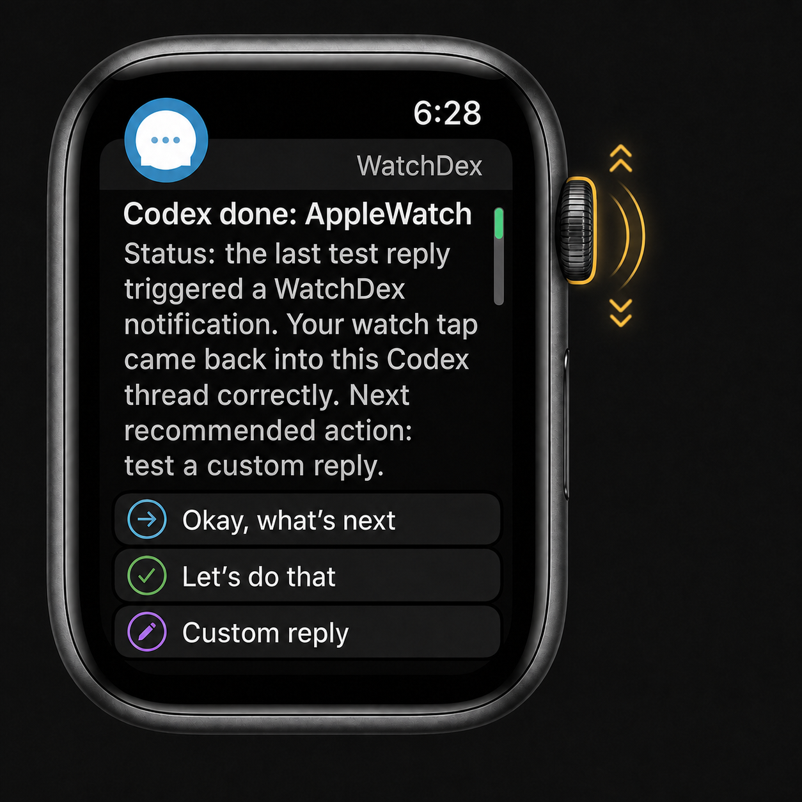
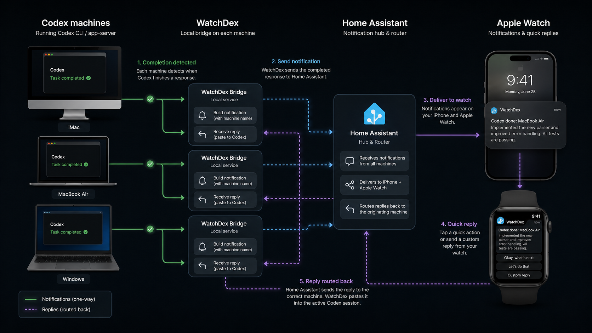

# WatchDex

[](#requirements)
[](#providers)
[](docs/home-assistant.md)
[](#pushcut)

## Visual Overview

<p align="center">
  
  
</p>

<p align="center">
  <em>Review the Codex result from your wrist, then route replies back to the right machine.</em>
</p>

WatchDex sends completed Codex task alerts to your Apple Watch and records
quick replies from your wrist.

It is a local bridge for people who start Codex work on one or more machines,
walk away, and still want a fast way to review the result and answer the next
obvious prompt: "Okay, what's next?", "Let's do that", or a custom reply.

## What It Does

- Installs a Codex `Stop` hook that fires when a Codex turn completes.
- Watches Codex session logs as a fallback when hooks miss a completed reply.
- Sends an actionable notification through Home Assistant or Pushcut.
- Opens a signed, scrollable full-response page when you tap the phone
  notification or the `View full` action.
- Shows Apple Watch actions for:
  - `View full`
  - `Okay, what's next`
  - `Let's do that`
  - a typed custom reply
- Routes replies back to the original Codex machine with per-notification
  `replyUrl` data.
- Can paste watch replies into the visible Codex desktop thread.
- Records replies in `data/replies.jsonl` so you have a local decision log.
- Can wrap any shell command and notify you when it finishes.
- Includes auto-resume modes for sending replies back to Codex.

WatchDex is Mac-first and local-first. The free path uses Home Assistant
Companion for iPhone and Apple Watch. Pushcut is also supported if you already
prefer its notification workflow.

## Project Status

WatchDex is currently a working local bridge, not a native iOS/watchOS app.

The reliable path today is:

```text
Codex finishes work
  -> Codex Stop hook runs WatchDex
  -> WatchDex session watcher catches missed Stop hooks
  -> WatchDex sends a provider notification
  -> Apple Watch shows quick actions
  -> provider calls WatchDex /reply
  -> WatchDex records the response locally
  -> optional auto-resume starts a Codex turn with that response
```

Auto-continuing Codex from a watch tap is off by default. When enabled,
`app-server` mode uses Codex's local app-server protocol to resume the recorded
session and submit the watch reply as a new turn. `Okay, what's next` is wrapped
as a status-only prompt so it does not start new background work; `Let's do
that` is the action-oriented reply.

If you want the watch reply to appear in the currently open Codex desktop
thread, use `foreground` mode. It activates Codex.app, pastes the literal watch
reply text into the visible input, and submits it through the UI. macOS must allow the
process running WatchDex, plus `osascript` when prompted, to control the
computer in **Privacy & Security > Accessibility**.

## Requirements

- macOS
- Node.js 18 or newer
- Codex desktop app with hooks enabled
- Apple Watch paired to an iPhone
- One notification provider:
  - Home Assistant Companion for the free route
  - Pushcut for the simpler webhook route

No npm package dependencies are required for the bridge itself.

## Quick Start

Clone the repo, then from the project root:

```sh
git clone https://github.com/nash226/WatchDex.git
cd WatchDex
npm run check
node ./bin/codex-watch.js setup
npm run install-hook
```

Edit `.env` and choose a provider. For the free Home Assistant route:

```sh
WATCH_BRIDGE_PROVIDER=home-assistant
HOME_ASSISTANT_URL=http://homeassistant.local:8123
HOME_ASSISTANT_TOKEN=YOUR_LONG_LIVED_ACCESS_TOKEN
HOME_ASSISTANT_NOTIFY_SERVICE=notify.mobile_app_your_iphone
WATCH_BRIDGE_PUBLIC_URL=http://YOUR_MAC_LAN_IP:8765
WATCH_BRIDGE_HOST=0.0.0.0
WATCHDEX_MACHINE_NAME=MacBook Air
```

If you do not have Home Assistant running yet, use the local setup in the
[Home Assistant](#home-assistant) section before testing notifications.

Start the reply server:

```sh
npm run server
```

In Codex, open `/hooks`, review the `WatchDex` hook, and trust it. Codex
requires approval before changed user hooks are allowed to run.

Send a test notification:

```sh
npm run test-notify
```

Read replies:

```sh
npm run replies
```

## Providers

| Provider | Cost | Best For | Notes |
| --- | --- | --- | --- |
| Home Assistant | Free | Local-first Apple Watch replies without Pushcut | Requires Home Assistant Companion on iPhone and Watch plus callback automations. |
| Pushcut | Pushcut plan may be required for dynamic actions | Fast webhook setup if you already use Pushcut | Dynamic notification fields and actions may require Pushcut Pro. |

## Home Assistant

Home Assistant is the recommended free path. WatchDex sends an actionable
mobile notification to the Home Assistant Companion app, and Home Assistant
automations call back into WatchDex when you tap a watch action.

For a local Mac test, WatchDex includes scripts to install Home Assistant Core
inside an ignored virtualenv:

```sh
brew install libjpeg-turbo
npm run ha:install
npm run ha:init-config
npm run ha:start
```

Then open:

```text
http://localhost:8123
```

For a longer-running local setup, install macOS LaunchAgents for both Home
Assistant and the WatchDex bridge:

```sh
npm run services:install
npm run services:status
```

For setup details, callback automations, and temporary remote access through
Cloudflare Quick Tunnel, see [docs/home-assistant.md](docs/home-assistant.md).

For the full system design, see [docs/architecture.md](docs/architecture.md).
For the native Apple Watch app scaffold, see [watchos/README.md](watchos/README.md).

## Multiple Machines

One Home Assistant instance can receive WatchDex notifications from every
computer where you run Codex. Install WatchDex on each machine, give each one a
unique `WATCHDEX_MACHINE_NAME`, and set `WATCH_BRIDGE_PUBLIC_URL` to a callback
URL for that machine.

New Home Assistant actions include the originating machine's `replyUrl`, token,
and machine name. That means a reply from your watch can route back to the
MacBook Air notification that created it instead of always returning to the
first Mac you configured.

### Apple Watch Custom Dictation Fallback

Home Assistant's native notification text input can work from iPhone while
failing to emit an event from Apple Watch. If canned Watch buttons work but
dictated custom replies disappear, switch the custom action to Apple Shortcuts:

```sh
HOME_ASSISTANT_CUSTOM_REPLY_MODE=shortcut
WATCHDEX_SHORTCUT_NAME=WatchDex Reply
```

Create an iPhone Shortcut named `WatchDex Reply`:

1. Add `Dictate Text`.
2. Add `Get Contents of URL`.
3. Set the URL field in `Get Contents of URL` to `Shortcut Input`.
4. Set method to `POST`.
5. Set request body to JSON with `prompt` and `reply_text` both set to the
   dictated text from step 1.

When you tap `Custom reply`, WatchDex opens that Shortcut with the current
task's `/reply` URL as the shortcut input. The Shortcut dictates your response
and posts it directly back to WatchDex.

## Pushcut

Create a Pushcut notification, copy its webhook URL, and configure:

```sh
WATCH_BRIDGE_PROVIDER=pushcut
PUSHCUT_WEBHOOK_URL=https://api.pushcut.io/YOUR_SECRET/notifications/codex-task
WATCH_BRIDGE_PUBLIC_URL=http://YOUR_MAC_LAN_IP:8765
WATCH_BRIDGE_HOST=0.0.0.0
```

WatchDex sends dynamic `title`, `text`, and `actions` fields in the Pushcut
JSON body. Each action performs a background web request to:

```text
${WATCH_BRIDGE_PUBLIC_URL}/reply
```

`WATCH_BRIDGE_TOKEN` is included in the query string and request body so random
callers cannot record replies.

## Commands

| Command | Purpose |
| --- | --- |
| `npm run check` | Syntax-check the WatchDex CLI. |
| `node ./bin/codex-watch.js setup` | Create `.env` with a generated reply token. |
| `npm run install-hook` | Install the Codex `Stop` hook. |
| `npm run server` | Start the local WatchDex reply server. |
| `npm run test-notify` | Send a manual provider notification. |
| `npm run replies` | Print recent watch replies. |
| `npm run tasks` | Print recent recorded tasks. |
| `node ./bin/codex-watch.js run -- <command>` | Run a command and notify when it exits. |
| `npm run ha:install` | Install Home Assistant Core into `.local/`. |
| `npm run ha:init-config` | Create a minimal local Home Assistant config. |
| `npm run ha:start` | Start local Home Assistant Core. |
| `npm run ha:doctor` | Inspect the local Home Assistant install. |
| `npm run services:install` | Install macOS LaunchAgents for Home Assistant and WatchDex. |
| `npm run services:start` | Start the LaunchAgents. |
| `npm run services:stop` | Stop the LaunchAgents. |
| `npm run services:status` | Print LaunchAgent status. |
| `npm run watch:sessions` | Watch Codex session logs for completed responses missed by hooks. |
| `npm run scan:sessions` | Scan recent Codex session logs once without notifying old history. |
| `npm run remote:install` | Install a Cloudflare Quick Tunnel LaunchAgent for Home Assistant. |
| `npm run remote:start` | Start the Cloudflare Quick Tunnel LaunchAgent. |
| `npm run remote:stop` | Stop the Cloudflare Quick Tunnel LaunchAgent. |
| `npm run remote:status` | Print Cloudflare Quick Tunnel LaunchAgent status. |
| `npm run remote:url` | Print the current temporary Cloudflare tunnel URL. |

## Configuration

WatchDex reads `.env` from the repo root.

| Variable | Required | Description |
| --- | --- | --- |
| `WATCH_BRIDGE_PROVIDER` | Yes | `home-assistant` or `pushcut`. |
| `WATCH_BRIDGE_PUBLIC_URL` | Yes | URL your provider can call back to, ending before `/reply`. |
| `WATCHDEX_MACHINE_NAME` | No | Human-readable machine name shown in notifications, for example `MacBook Air`. Defaults to the OS hostname. |
| `WATCH_BRIDGE_TOKEN` | Recommended | Shared secret required by `/reply`. Generated by setup. |
| `WATCH_BRIDGE_HOST` | No | Server bind host. Use `0.0.0.0` for LAN callbacks. |
| `WATCH_BRIDGE_PORT` | No | Server port. Defaults to `8765`. |
| `WATCH_BRIDGE_DATA_DIR` | No | Directory for `tasks.jsonl`, `replies.jsonl`, and `events.jsonl`. |
| `HOME_ASSISTANT_URL` | Home Assistant | Base URL for Home Assistant. |
| `HOME_ASSISTANT_TOKEN` | Home Assistant | Long-lived access token. |
| `HOME_ASSISTANT_NOTIFY_SERVICE` | Home Assistant | Mobile app notify service, for example `notify.mobile_app_your_iphone`. |
| `HOME_ASSISTANT_INTERRUPTION_LEVEL` | No | iOS interruption level. Defaults to `time-sensitive`. |
| `HOME_ASSISTANT_CUSTOM_REPLY_MODE` | No | `reply` uses Home Assistant native text input. `shortcut` makes `Custom reply` launch an Apple Shortcut. Defaults to `reply`. |
| `WATCHDEX_SHORTCUT_NAME` | No | Shortcut name used when `HOME_ASSISTANT_CUSTOM_REPLY_MODE=shortcut`. Defaults to `WatchDex Reply`. |
| `PUSHCUT_WEBHOOK_URL` | Pushcut | Pushcut notification webhook URL. |
| `PUSHCUT_SOUND` | No | Pushcut sound name. Defaults to `jobDone`. |
| `PUSHCUT_TIME_SENSITIVE` | No | Send Pushcut alerts as time-sensitive. Defaults to `true`. |
| `WATCH_BRIDGE_AUTO_RESUME` | No | Continue Codex from watch replies. Defaults to `false`. |
| `WATCH_BRIDGE_AUTO_RESUME_MODE` | No | `cli` for `codex exec resume`, `app-server` for background app-server turns, or `foreground` for visible Codex.app submission. Defaults to `cli`. |
| `WATCHDEX_SESSION_WATCH_INTERVAL_MS` | No | Session watcher polling interval. Defaults to `5000`. |
| `WATCHDEX_SESSION_WATCH_DEBOUNCE_MS` | No | Delay before notifying a completed session message. Defaults to `8000`. |
| `CODEX_BIN` | No | Path to the Codex CLI used by `cli` auto-resume. |
| `CODEX_APP_SERVER_BIN` | No | Path to the Codex CLI used by `app-server` auto-resume. Defaults to `~/.local/bin/codex` when installed. |

To make watch replies start a Codex turn, install the standalone Codex CLI and
enable app-server mode:

```sh
curl -fsSL https://chatgpt.com/codex/install.sh | sh
```

```sh
WATCH_BRIDGE_AUTO_RESUME=true
WATCH_BRIDGE_AUTO_RESUME_MODE=foreground
CODEX_APP_SERVER_BIN=/Users/YOUR_USER/.local/bin/codex
```

## Data And Security

- `.env` is ignored by git and should contain your local tokens only.
- `.local/` is ignored and stores local Home Assistant and launchd logs.
- Full-response notification links use `/task?id=...&token=...`, so the
  scrollable task page is protected by the same local bridge token as replies.
- `data/tasks.jsonl` stores completion events.
- `data/replies.jsonl` stores watch replies.
- `data/events.jsonl` stores provider delivery attempts.
- `data/session-watch-state.json` stores session message ids already seen by
  the fallback watcher.
- `/reply` rejects requests with an invalid token when `WATCH_BRIDGE_TOKEN` is
  set.

If your watch or phone is not on the same network as your Mac, expose the
callback URL through a trusted tunnel such as Cloudflare Tunnel, ngrok, or
Tailscale. Keep the token private either way.

## Current Limitations

- Home Assistant replies include per-task action data for new notifications;
  older static actions still fall back to the latest task.
- Home Assistant supports a `Custom reply` action that prompts for text and
  submits that exact text to Codex in foreground mode.
- Auto-resume depends on usable Codex session ids in hook payloads or the
  session watcher fallback.
- There is no native iOS/watchOS app yet, so WatchDex relies on Home Assistant
  or Pushcut for notification delivery.

## Roadmap

- Configurable reply choices.
- Safer Codex resume queue with reviewable pending actions.
- Packaged install flow.
- Native iOS/watchOS app exploration.
- Windows foreground submitter.

## References

- Pushcut notification webhooks and Apple Watch actions: https://www.pushcut.io/support/notifications
- Home Assistant actionable notifications: https://companion.home-assistant.io/docs/notifications/actionable-notifications/
- Codex hooks and the `Stop` event: https://developers.openai.com/codex/hooks
- Codex user-level config and hook locations: https://developers.openai.com/codex/config-advanced
