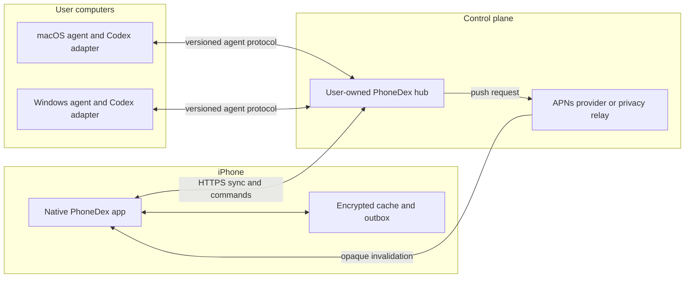

# PhoneDex Product Foundation

Status: Canonical product source of truth  
Last reviewed: 2026-07-15  
Companion documents: [Architecture](architecture.md), [Delivery roadmap](ROADMAP.md)

## 1. Purpose

PhoneDex is a premium native iPhone command center for Codex work running on a
user's Mac and Windows computers. It should let someone leave a desk without
losing the thread: see what is running, understand what completed, answer a
question, review consequential output, and safely direct the next step.

The product is not a remote-desktop skin and does not promise to reproduce
every private Codex Desktop view on iPhone. Practical parity means supporting
the high-value jobs a person performs in Codex Desktop through PhoneDex-owned,
documented contracts. Pixel parity, unrestricted control of another app's UI,
and access to private desktop state are not goals.

This document defines the intended product. [README](../README.md) describes
what the repository can run today. [Architecture](architecture.md) describes
the current bridge. [ROADMAP](ROADMAP.md) is the ordered execution plan.

### Requirement language

- **Current**: implemented in this repository and observed in the reviewed
  sources. It is not necessarily production-ready.
- **Target**: committed product behavior, gated by the roadmap.
- **Exploratory**: useful direction that still requires a supported technical
  path or a human product decision.
- **Must**, **should**, and **may** carry their usual requirements meanings.

## 2. Product Thesis

Codex work is often asynchronous, but its control surface is tied to the
computer where the work began. The user either stays nearby, misses a useful
decision point, or reaches for brittle remote-control tools. PhoneDex should
make asynchronous Codex work feel continuous across devices while preserving
the context, permissions, and accountability of the originating computer.

The product wins when a user can confidently answer three questions from an
iPhone in seconds:

1. What needs me now?
2. What changed, and can I trust the result?
3. What is the safest useful action I can take next?

### North-star outcome

A user can move between Mac, Windows, and iPhone without losing task identity,
conversation context, execution state, or control, and without exposing source
code or credentials to infrastructure that does not need them.

### Product goals

- Make waiting Codex tasks and approvals visible within seconds.
- Make short, high-confidence interventions possible with one hand.
- Preserve enough context to prevent replies to the wrong task or machine.
- Support multiple user-owned computers without pretending they share local
  Codex state automatically.
- Prefer supported, versioned integration paths and expose capability gaps
  honestly.
- Remain useful on a local network or private VPN before requiring a hosted
  PhoneDex service.
- Reach App Store quality in security, reliability, accessibility, and support.

### Non-goals

- Mirroring or scraping every Codex Desktop screen.
- General-purpose remote desktop, terminal, or file-system administration.
- Silent approval of arbitrary commands or permission escalation.
- Executing a desktop Codex runtime inside the iOS app.
- Depending on macOS Accessibility automation as the universal control path.
- Copying Figma, Instagram, Discord, or Codex Desktop visual design.
- Claiming account-wide task discovery without a supported account API or an
  installed agent on every participating machine.

## 3. Current Baseline

The repository already proves the core loop, but not the final product.

### Current bridge and agent

- A Codex `Stop` hook and a session-file watcher capture completed responses;
  when source device, session, and message identity are available, both paths
  converge into one logical completion with bounded provenance and no duplicate
  visible notification.
- Each Mac or Windows computer can run a local Node agent and heartbeat to a
  PhoneDex hub.
- The hub stores recent tasks, replies, events, and device state in local files.
- Authenticated HTTP endpoints expose recent tasks and devices and accept task
  ingestion and replies.
- Replies can route to an origin machine. On Mac they can optionally resume a
  CLI or app-server session or paste into the foreground Codex app.
- Agent enrollment, install reporting, and device coverage checks exist.
- Device records preserve separate reachability, PhoneDex agent, and Codex
  adapter health; unsupported adapter health is shown as unknown.

### Current iOS prototype

- A native SwiftUI shell provides Chats, Workspaces, Browser, Devices, and
  Settings, with read-only workspace and device detail surfaces for machine
  context, task counts, heartbeat health, and actionable diagnostics.
- The app stores one bridge URL and a paired device credential in Keychain,
  restores an encrypted local task/device cache, and reconciles from the hub's
  opaque cursor while foregrounded. Legacy token entry remains for migration.
- The app schedules a local notification and registers three reply actions.
- A notification content extension renders a long, scrollable result.
- Notification actions post canned or typed/dictated replies to the bridge.
- Task detail shows the latest response, lifecycle summary, capture provenance,
  repository/branch context when supplied, honest evidence availability, and a
  keyboard-safe composer with encrypted draft and logical reading-position
  restoration.
- Structured `needs_input` tasks can show bounded choices and an optional free-
  text answer field; answers preserve question identity through delivery.
- Allowlisted Mac and Windows agents can expose a bounded managed-task control
  surface: choose an advertised workspace to create a run, then cancel or
  retry that PhoneDex-owned run when the negotiated capability is present.
  Existing desktop-captured tasks remain read-only from the iPhone.
- Agents with a ready CLI or app-server adapter can prepare a bounded desktop
  handoff that preserves the exact task and Codex session identity without
  invoking private desktop UI or exposing local paths and credentials.
- Configuration and preview actions can be invoked through a custom URL scheme.
- The project targets iOS 17 and includes unit and UI test targets for the
  native shell.

### Not production-ready today

- There is no APNs provider path, remote push registration, or reliable
  background refresh.
- The iOS app restores an encrypted local cache, resumes foreground sync from a
  durable cursor, and distinguishes loading, stale, offline, revoked,
  incompatible, and partial refresh states; reply commands are now persisted
  in the same encrypted cache for offline retry.
- The iOS app has no complete live-progress model, approval response controls,
  artifact viewer, or general lifecycle command queue; task detail renders
  bounded approval review metadata when exported by the bridge, with the
  managed-task controls described above.
- The shared token remains part of legacy setup and can be accepted in URLs by
  the current bridge; notification payloads no longer contain it. The iOS
  settings token is stored in device-only Keychain storage, with legacy
  `UserDefaults` migration.
- Release ATS no longer allows arbitrary network loads, and configured
  non-loopback bridges require HTTPS; loopback HTTP remains available only for
  local development. Hub and agent TLS deployment is still release work.
- Reply and managed lifecycle commands carry a client idempotency key and
  expected task version; the bridge persists command receipts and the iPhone
  exposes accepted, duplicate, stale, and failed delivery states. Approval
  requests now carry bounded operation, scope, origin, reason, risk, expiry,
  and task-version metadata; response controls and agent execution remain
  future work.
- Paired credentials can be rotated without changing task history, protected
  requests are rate-limited per principal, and reply idempotency keys reject
  mutated replays. Content-free security lifecycle outcomes are written to the
  hub audit log without serializing credentials or task text.
- Legacy bridge endpoints still expose a recent slice of append-only JSONL data,
  but the authenticated `/sync` contract now provides versioned snapshot pages,
  opaque cursors, stable ordering, and tombstones. The native iPhone client
  persists its cursor and encrypted cache; reply and managed lifecycle receipts
  are implemented while general lifecycle queuing remains future work.
- Starting, canceling, and retrying are defined only for PhoneDex-owned,
  allowlisted runs through the capability-gated agent contract. Approving or
  streaming an arbitrary Codex task is not a defined cross-platform contract.
- Foreground UI automation is Mac-specific, permission-sensitive, and brittle.

These limitations are release blockers, not details to hide behind polish.

## 4. Practical Desktop Parity

PhoneDex should prioritize the jobs that matter away from a desk. A feature is
at parity only when it preserves task identity, shows honest state, and uses a
supported command path on the originating machine.

| User capability | Product outcome | Status and feasible path |
| --- | --- | --- |
| Find recent work | Unified, searchable tasks grouped by workspace and machine | **Target.** Extend the hub protocol and durable store. |
| Read a completed response | Rich, readable transcript with machine and workspace context | **Current, partial.** Completion text exists; full transcript sync does not. |
| Reply to a task | Send text or a constrained quick action with delivery state | **Current, partial.** Reply receipts, retries, task-version conflict checks, and structured question responses exist; broader agent commands remain partial. |
| See live progress | Running state, concise activity, and latest meaningful event | **Target.** Requires structured agent events; iOS cannot infer this from desktop UI. |
| Start a task | Choose a machine/workspace, enter a prompt, and create a tracked run | **Current, bounded.** Allowlisted agents expose a versioned create command; arbitrary desktop task creation is not promised. |
| Answer a question | Render explicit choices or text input and resume the same task | **Current, partial.** Bounded task questions and reply envelopes exist; richer event streams and adapter-native continuation remain future work. |
| Review an approval | Show exact operation, scope, risk, and origin before approve/reject | **Current, bounded.** Expiring task-version-bound review metadata and capability-gated controls are native; configurable Face ID or device-passcode confirmation is enabled by default before an approval decision is sent. |
| Review changes | Mobile diff summary, file list, patch detail, and validation results | **Current, partial.** Supported agents can export bounded patches for native mobile review alongside structured file, artifact, source-reference, and validation metadata; full artifact downloads remain target work. |
| Cancel, retry, or queue | Issue idempotent lifecycle commands with visible receipts | **Target.** Requires adapter capability negotiation. |
| Cancel, retry, or queue | Issue idempotent lifecycle commands with visible receipts | **Current, bounded.** Cancel/retry apply to PhoneDex-owned runs when advertised; general queueing remains Target. |
| Open on desktop | Deep-link or hand off to the exact supported task/session | **Current, bounded.** A ready Mac or Windows CLI/app-server adapter can prepare a redacted handoff manifest; private desktop UI automation is not promised. |
| Reproduce all desktop tools | Exact private UI, terminal, extensions, and local integrations | **Not promised.** Use explicit mobile workflows or hand off to the computer. |

Unsupported actions must be absent or disabled with a specific explanation.
PhoneDex must never show a control that merely hopes desktop automation will
work.

## 5. People and Jobs

### Primary: mobile maker

A developer or creator runs one or several Codex tasks, leaves the computer,
and wants to keep useful work moving from an iPhone.

Jobs:

- Tell me immediately when a task needs judgment, not for every log line.
- Let me understand the result without reconstructing computer context.
- Let me dictate a response and know whether it reached the right session.
- Let me approve a narrow, well-explained operation without opening a laptop.

### Primary: multi-device professional

A user works across a MacBook, desktop Mac, and Windows workstation with
different repositories and availability.

Jobs:

- Show which machine owns a task and whether that machine is reachable.
- Keep workspaces and similarly named tasks distinguishable.
- Route commands to the origin without exposing each computer directly.
- Explain whether a failure is in Codex, an agent, the hub, or connectivity.

### Secondary: reviewer or lead

A user delegates bounded work and cares more about changed files, tests,
approvals, and final outcomes than the raw transcript.

Jobs:

- Triage tasks that need review.
- Inspect the evidence behind a completion claim.
- Request a correction with precise context.
- Maintain an audit trail of decisions and command outcomes.

### Secondary: privacy-conscious local-first user

A user will run a hub and VPN but does not want source content in a vendor
cloud.

Jobs:

- Pair devices without pasting durable secrets.
- Keep task content on user-owned devices by default.
- See and control retention, redaction, telemetry, and connected devices.
- Revoke a lost phone without visiting every computer.

## 6. Product Principles

### Native before novel

Use SwiftUI, system navigation, context menus, sheets, search, share, dictation,
Dynamic Type, VoiceOver, haptics, and platform-standard state restoration.
Custom interaction is justified only when it makes task control safer or
faster.

### Content first, chrome second

The task result, question, diff, or approval is the primary visual object.
Navigation and decoration should recede. Dense operational screens should be
easy to scan and should not look like marketing pages.

### Context travels with every action

Every task and command surface must retain machine, workspace, repository,
branch when known, task state, and freshness. Similar task titles cannot be
allowed to become ambiguous.

### Fast lane and deliberate lane

Low-risk replies should take seconds. Consequential actions require explicit
review. Speed must come from prepared context and constrained choices, not from
removing safeguards.

### Honest distributed state

The UI distinguishes pending, sent, acknowledged, running, completed, failed,
expired, offline, and unknown. It never turns a local tap into a false success.

### Capability, not platform assumption

Each agent declares what its installed Codex adapter can do. The app renders
from those capabilities instead of assuming Mac and Windows behave alike.

### Local-first with a clear remote path

Direct hub access over LAN or a user-managed private network is a first-class
deployment. A hosted relay may improve reachability, but it must not quietly
become a content collector.

### Recoverable by design

Commands are idempotent, drafts survive interruption, failures explain the
next action, and reconnecting devices reconcile from durable cursors.

### Premium through restraint

Quality comes from typography, motion, latency, hierarchy, haptics, and exact
states. It does not come from ornamental gradients, oversized cards, or a
palette dominated by one fashionable hue.

### Learn from interaction strengths, never clone

- From Figma: preserve selection and context, disclose precision controls only
  when needed, and make object state legible.
- From Instagram: keep the primary content immersive, make capture and reply
  thumb-friendly, and preserve place when moving between items.
- From Discord: make hierarchy, unread activity, presence, and persistent
  conversation continuity easy to scan.
- From iOS: use familiar navigation, editing, accessibility, permissions, and
  feedback patterns as the final authority.

PhoneDex must not reproduce another product's visual identity, navigation
labels, iconography, or signature layout.

## 7. Information Architecture

The primary app uses five stable tabs. A notification or universal link opens
the relevant destination inside this structure rather than a separate mini-app.

### Chats

The default tab combines the actionable Inbox with persistent task
conversations and answers "what needs me now?"

- A segmented scope switches between **Needs You**, **Running**, and **Recent**.
- Rows are grouped by urgency and recency, not by decorative containers.
- Each row shows state, title, machine, workspace, relative time, and one useful
  secondary fact such as tests passed or a pending question.
- Unread is a subtle semantic marker. It is not equivalent to unfinished.
- Search covers title, workspace, repository, branch, machine, and indexed
  transcript text permitted by retention settings.
- Filters support machine, workspace, state, and date.
- Swipe actions are limited to reversible organization such as mark read,
  archive, or mute. Task cancellation is never a casual swipe.

### Workspaces

Workspaces organize durable context across task runs.

- A workspace maps to a repository or user-defined working directory on a
  specific machine; two machines can expose separate instances.
- The list shows active task count, latest outcome, branch when known, and
  machine availability.
- Workspace detail shows task history, current runs, saved prompt drafts, and
  artifacts the agent has explicitly exported.
- Starting work begins here when the selected agent advertises that capability.

### Browser

The built-in browser keeps research, documentation, pull requests, and task
artifacts inside the PhoneDex working context.

- It uses the native WebKit engine with familiar address, back, forward,
  reload, and share controls.
- Opening a task link preserves the originating task and workspace so the user
  can return without reconstructing context.
- Browser history and website data remain on-device under normal iOS controls.
- PhoneDex does not inject credentials, bypass website security, or treat web
  content as trusted Codex instructions.
- Future task-aware browser actions must show exactly what context will be sent
  back to Codex before submission.

### Devices

Devices make the distributed system understandable.

- Each row shows machine name, platform, role, last seen, agent version,
  adapter version, connectivity, and capability summary.
- Detail separates hub reachability, agent health, Codex adapter health, and
  last successful command.
- Pair, rename, revoke, diagnostics, and update guidance live here.
- Missing, stale, task-only, incompatible, and revoked are distinct states.

### Settings

Settings contain connection, notification, privacy, security, appearance,
diagnostics, and support controls.

- Durable credentials are never displayed after pairing.
- The user can choose notification privacy, retention, biometric requirements,
  telemetry level, and per-workspace notification policy.
- Destructive account or local-data actions explain scope and require
  confirmation.
- Developer diagnostics are isolated from normal product settings.

### Global destinations

- Notification deep links open a specific task, question, approval, or device
  incident.
- Universal search is available from Chats and Workspaces.
- A global create command appears only when at least one reachable agent can
  create tasks. It opens a sheet rather than changing the tab model.
- A compact sync indicator appears only for actionable degraded states.

## 8. Core Experience

### 8.1 First run and pairing

1. Explain the local hub requirement and what task content can leave a computer.
2. Discover a hub on the local network when permission is granted, or accept a
   QR code, universal link, or manually entered HTTPS endpoint.
3. Exchange a short-lived, single-use pairing grant for a device-bound
   credential. Never put the durable credential in a URL.
4. Show matching verification words or digits on both trusted surfaces before
   granting control capability.
5. Store credentials in Keychain and register the phone as a revocable device.
6. Verify reachability and protocol compatibility.
7. Explain notifications in product context, then request iOS permission.
8. Deliver a private test event and let the user choose preview visibility.

Pairing must fail closed on certificate, identity, protocol, or clock-skew
errors. A manual path must remain available when discovery is unavailable.

### 8.2 Inbox triage

On launch, the app restores the last stable tab and immediately renders a local
cache with freshness indicators. It then reconciles from the last event cursor.

Needs You contains only tasks with a question, an approval, a requested review,
or a failed command requiring intervention. Completed informational tasks stay
in Recent. A user can mark an item read without changing task state.

### 8.3 Task detail

Task detail is the primary working surface:

1. A compact header shows task state, machine, workspace, branch when known,
   and freshness.
2. A status summary names the current outcome or blocker in one or two lines.
3. A chronological transcript shows structured messages and meaningful events.
   Noisy tool logs are collapsed behind disclosure.
4. An evidence area shows changed files, diff summary, validation, links, and
   artifacts when exported by the agent.
5. A bottom composer remains reachable above the keyboard and supports typing,
   system dictation, draft preservation, and task-specific suggestions.
6. An action menu contains only supported lifecycle commands. Consequential
   commands open a confirmation sheet with scope and expected effect. A
   capability-gated desktop handoff preserves the exact task/session identity
   and clearly states that the user continues on the named computer.

The view preserves reading position when new events arrive. It shows a "new
activity" affordance instead of jumping the user to the bottom.

### 8.4 Questions and replies

- Structured questions render their allowed choices plus a custom response
  when the adapter permits one.
- Free text is never silently transformed into a different instruction.
- Quick replies display the exact prompt or action semantics before first use
  and remain configurable later.
- Sending creates a durable local command immediately, then shows transport and
  agent acknowledgement separately.
- A failed or timed-out command can be retried with the same idempotency key.
- If the task advanced before the reply arrived, PhoneDex requests review
  instead of applying stale input automatically.

### 8.5 Approvals

An approval sheet must show:

- the requesting task, machine, workspace, and repository;
- the exact command, tool operation, path scope, or network destination;
- the reason supplied by Codex and the agent-assigned risk class;
- whether approval is one-time, task-scoped, or unsupported;
- expiry and current agent reachability.

Approve and reject are explicit controls. PhoneDex enables Face ID or device
passcode confirmation by default for these high-risk decisions, with a
user-configurable setting and passcode fallback when supported by iOS. The
agent command and receipt remain the final authority; authentication alone
never reports success. PhoneDex 1.0 does not offer "approve all" or convert an
expired approval into a new one.

### 8.6 Create task

When supported, the create sheet asks for a machine, workspace, prompt, and
optional execution profile. It shows why a machine is unavailable and saves a
draft when creation cannot proceed. The resulting task appears immediately as
`queued`, with command acknowledgement following separately.

The app must not accept an arbitrary local path that the selected agent has not
advertised. Remote shell syntax is not a substitute for a workspace picker.

### 8.7 Diff and artifact review

- Start with a file-level summary and validation results.
- Use a native, virtualized diff viewer with additions, deletions, context
  expansion, file navigation, copy, and share controls.
- Clearly label generated summaries and preserve access to source patches.
- Treat binary and oversized artifacts as explicit downloads with size and
  type, not inline assumptions.
- Do not execute downloaded artifacts on iPhone.

### 8.8 Notifications

Notification classes are: needs input, approval requested, completed, failed,
device unavailable, and security event.

- Default payloads contain an opaque event identifier and privacy-safe summary;
  the app fetches authorized content after opening or background processing.
- User-selected Full Preview may include a concise result, understanding that
  notification text is visible to Apple delivery systems and on the lock screen
  according to iOS settings.
- Actions are constrained, idempotent, and valid without embedding durable
  secrets in notification metadata.
- Notification grouping uses task and workspace identity consistently.
- Duplicate capture paths cannot generate duplicate visible notifications.
- A notification that has expired or already been handled opens current task
  state and explains the change.
- A Live Activity may summarize a long-running task, but it is an enhancement,
  not the source of truth or a guarantee of continuous background execution.

### 8.9 Offline and degraded behavior

- Cached content remains readable and is stamped with last sync time.
- Drafts and low-risk replies can enter an encrypted outbox.
- Approval, cancel, and other time-sensitive commands require a reachable agent
  unless the protocol explicitly supports queued execution and shows that fact.
- The app distinguishes no internet, hub unreachable, origin device offline,
  adapter incompatible, auth revoked, and server error.
- Reconnection uses a durable cursor and reconciles command receipts before
  enabling another attempt.

## 9. Functional Requirements

### Identity and pairing

- **ID-01:** The app must pair without requiring the user to copy a durable
  bearer token.
- **ID-02:** Every phone, hub, and agent must have a stable, revocable identity.
- **ID-03:** A hub must be able to restrict a phone to read, reply, approve, or
  administer scopes independently.
- **ID-04:** Pairing grants must be single-use, short-lived, and auditable.
- **ID-05:** Credential rotation must not lose task history or command receipts.
- **ID-06:** Multiple hubs may be supported later, but 1.0 may intentionally
  support one active hub if migration and reset behavior are explicit.

### Tasks and events

- **TASK-01:** The app must list tasks with pagination or cursor sync beyond the
  current most-recent-25 endpoint.
- **TASK-02:** Every task must include origin device, workspace identity,
  lifecycle status, created/updated timestamps, and monotonically increasing
  version or event position.
- **TASK-03:** Task detail must render structured messages without requiring raw
  session-file parsing on iPhone.
- **TASK-04:** Duplicate hook and watcher captures must converge on one logical
  task event.
- **TASK-05:** Read, unread, archived, and muted are user presentation state and
  must not overwrite agent execution state.
- **TASK-06:** Search and filters must return stable results across refreshes.
- **TASK-07:** The hub must expose tombstones or equivalent semantics for data
  deleted on another client.

### Commands

- **CMD-01:** Reply, create, cancel, retry, approve, reject, and handoff must use
  a common command envelope when each capability becomes available.
- **CMD-02:** Every command must have a client-generated idempotency key,
  expected task version, actor, issued time, expiry, and requested capability.
- **CMD-03:** Command lifecycle must include local pending, accepted by hub,
  delivered to agent, accepted or rejected by adapter, and terminal outcome.
- **CMD-04:** Retrying after transport failure must not execute a command twice.
- **CMD-05:** A command rejected as stale must return current task state.
- **CMD-06:** Destructive or permission-bearing commands must be explicit and
  auditable.

### Devices and workspaces

- **DEV-01:** The hub must report device reachability separately from Codex
  adapter health.
- **DEV-02:** Agents must advertise protocol version, app version, platform,
  adapter type/version, and capability flags.
- **DEV-03:** Workspace identifiers must remain stable across path display-name
  changes and must be scoped to a device.
- **DEV-04:** A revoked or incompatible device must not receive new commands.
- **DEV-05:** Health screens must provide actionable diagnostics without
  exposing secrets.

### Notifications and sync

- **SYNC-01:** Foreground sync must resume from a durable cursor and tolerate
  duplicate or out-of-order event delivery.
- **SYNC-02:** Push must act as a wake or invalidation signal; durable hub state
  remains authoritative.
- **SYNC-03:** The app must reconcile notification actions into the same command
  store used by in-app actions.
- **SYNC-04:** Badge counts must represent actionable unread items, not total
  historical tasks.
- **SYNC-05:** The user must be able to configure notification classes globally
  and per workspace.

### Review and artifacts

- **REV-01:** Test and validation claims must identify the command, outcome,
  timestamp, and origin when supplied by the agent.
- **REV-02:** Diff content must be linked to a task version or commit identity.
- **REV-03:** Artifact downloads must validate declared size, content type, and
  integrity hash.
- **REV-04:** Sensitive artifacts must respect retention and export policy.

## 10. Domain Model and State

### Task

A task is a logical Codex work unit, not merely a notification.

Required fields include `taskId`, `originDeviceId`, `workspaceId`, `title`,
`status`, `createdAt`, `updatedAt`, `version`, `capabilities`, and `lastEventId`.
Optional fields include session/thread identifiers, branch, summary, transcript
references, diff references, validation results, question, approval request,
and terminal outcome.

Canonical lifecycle:

```text
queued -> running -> needs_input -> running -> succeeded
                  -> needs_approval -> running
queued|running|needs_* -> canceling -> canceled
queued|running|needs_* -> failed
any nonterminal state -> unreachable (derived connectivity state, not terminal)
```

`unreachable` overlays the last known lifecycle state. `archived`, `read`, and
`muted` are per-user presentation attributes, not lifecycle states.

### Event

An event is immutable and ordered within a hub stream. It has an `eventId`,
task, task version, type, timestamp, origin, visibility, and typed payload.
Clients may receive an event more than once and must deduplicate by id.

### Command

A command is an immutable request plus append-only receipts. It records actor,
scope, expected task version, expiry, idempotency key, and payload. The hub must
not rewrite a rejected command into a different action.

### Capability

Capabilities are versioned names such as `task.reply.v1`, `task.create.v1`,
`task.cancel.v1`, `approval.respond.v1`, `diff.read.v1`, and
`desktop.handoff.v1`. Capability presence means the complete contract is
implemented and tested for that agent, not merely that a button might work.

## 11. Cross-Device Architecture

### Required components



### User-owned hub

The hub is the durable coordination point. It authenticates devices, stores
normalized tasks/events/commands, routes commands, issues receipts, registers
push destinations, and enforces retention. It does not manufacture desktop
capabilities an agent has not declared.

The current Node bridge can evolve into this role, but append-only files and
unversioned endpoints are not sufficient for production sync. A transactional
store, migration strategy, backup behavior, API versioning, and concurrency
control are required.

### Computer agents

Each participating computer must run an agent unless a future supported
service can provide equivalent task state and control. Agents own local Codex
discovery, adapter compatibility, workspace allowlists, command execution, and
structured event export.

The Codex adapter is a boundary. CLI, app-server, hooks, or future supported
APIs can be implemented behind it. UI automation may remain an explicitly
experimental Mac adapter, but it cannot define production semantics.

### iPhone app

The app is a native client, not a persistent coordinator. It renders cached
state, syncs while foregrounded, responds to push opportunities, signs or
authenticates commands, maintains an encrypted outbox, and clearly represents
staleness. It must tolerate suspension and termination at any time.

### Connectivity modes

1. **Direct local or private network:** iPhone reaches the user-owned hub over
   trusted HTTPS on LAN, Tailscale, or an equivalent user-managed network. This
   is the first production path and keeps task content local.
2. **Hosted privacy relay, exploratory:** A PhoneDex service relays encrypted
   events and commands when direct reachability is unavailable. This requires
   a human decision on operating model, key management, abuse controls,
   retention, cost, and privacy policy.
3. **Supported account integration, exploratory:** If a documented provider
   API eventually exposes the required Codex task contracts, an adapter may
   reduce local infrastructure. PhoneDex must not assume that such an API
   includes private Codex Desktop state.

### Synchronization

- The hub owns an append-only logical event stream and issues opaque cursors.
- Snapshot plus cursor bootstrap avoids replaying an unbounded history.
- Clients acknowledge only their local sync position, never global deletion.
- Commands and their receipts share the event stream so every client converges.
- Server timestamps establish ordering; client timestamps support diagnostics.
- Schema versions are additive within a major protocol version. Unknown fields
  are ignored; unknown required event types cause a visible compatibility error.

### Push delivery

An iPhone cannot maintain a permanent background connection. The hub therefore
needs an APNs-capable provider or relay for timely remote awareness. Push is
best-effort and may be delayed or suppressed by iOS, so it signals the app to
fetch durable state. Critical product correctness cannot depend on a push being
delivered exactly once.

For a fully user-hosted direct mode, PhoneDex must document how the hub obtains
push service without distributing reusable provider credentials. Shipping an
official app normally implies a PhoneDex-operated minimal push service even if
task content stays on user devices.

## 12. Platform and Integration Constraints

### iOS constraints

- iOS apps are sandboxed and cannot read a computer's Codex files or run its
  tools directly.
- Background execution is opportunistic. Polling, sockets, and local-network
  discovery cannot be treated as continuously available while suspended.
- APNs delivery, notification presentation, and Live Activity updates are not
  guaranteed in real time.
- Local network access requires user permission. Plain HTTP and globally
  permissive App Transport Security exceptions are not acceptable production
  defaults.
- Notification extensions have constrained time and memory and are not a
  replacement for the full task screen.
- Lock-screen content may be visible to other people. Privacy-safe previews are
  the default.
- The app can use system dictation but must preserve the user's final text and
  let the user review it before consequential submission.

### macOS and Windows constraints

- Every computer owns its local repositories, Codex state, credentials, and OS
  permissions. A hub cannot infer those resources by account identity alone.
- Foreground app control on macOS requires Accessibility permission and depends
  on visible UI state. It is unsuitable as a silent, universal guarantee.
- Windows needs its own supported adapter for any foreground handoff or submit
  behavior. macOS automation cannot be projected onto Windows.
- Sleeping, logged-out, firewalled, or offline machines cannot accept immediate
  commands. Wake-on-LAN is outside 1.0 unless explicitly designed and secured.

### Codex integration constraints

- The current repository uses hooks, local session files, CLI resume,
  app-server invocation, and optional foreground automation. These paths have
  different semantics and do not by themselves provide full Desktop parity.
- PhoneDex must use documented, supported contracts where available. Any
  version-sensitive local integration must be isolated behind a compatibility
  adapter, pinned to tested versions, observable, and easy to disable.
- Private UI state or undocumented network endpoints must not become required
  production dependencies.
- Approval controls are shipped only when the adapter can prove that the
  approval maps to the exact pending operation and can return a receipt.
- When a supported capability is unavailable, the app offers read-only context
  and desktop handoff rather than pretending the action succeeded.

## 13. Security and Privacy

PhoneDex is a remote execution control surface. Its security bar is closer to a
developer credential manager than a casual notification utility.

### Protected assets

- source code, prompts, transcripts, diffs, artifacts, paths, and repository
  metadata;
- hub, agent, and phone credentials;
- approval grants and command authority;
- device inventory, presence, and workspace names;
- audit records that may contain sensitive context.

### Threats in scope

- a stolen or unlocked phone;
- interception or tampering on LAN, public internet, or a relay;
- replayed notification actions or commands;
- a malicious device enrolling with a leaked invite;
- one compromised agent attempting to impersonate another;
- secrets leaking through URLs, logs, crash reports, screenshots, or push text;
- stale approvals applied to changed task state;
- dependency or adapter updates changing command semantics.

### Required controls

- Store private keys and durable credentials in Keychain, using device-only
  access classes where recovery requirements permit.
- Use TLS for every production hop. Authenticate both device identity and
  authorization scope; use certificate pinning only with a safe rotation and
  recovery design.
- Use short-lived access credentials or signed requests derived from a
  revocable device identity. Never use a shared fleet-wide bearer token.
- Remove credentials from query strings, notification `userInfo`, analytics,
  error messages, and generated support bundles.
- Make pairing grants single-use, rate-limited, expiring, and bound to the hub
  the user verified.
- Use command idempotency, expected task versions, expiry, and nonce/replay
  protection.
- Require biometric or passcode confirmation for user-selected high-risk
  actions without making biometrics the only recovery path.
- Keep APNs payloads opaque by default. If Full Preview is enabled, disclose
  the lock-screen and provider visibility tradeoff.
- Encrypt sensitive local caches at rest and minimize data shared with the
  notification extension.
- Redact content and secrets from structured logs by default. Support bundles
  must preview exactly what will be exported.
- Provide device list, last access, credential rotation, immediate revocation,
  local cache deletion, and hub-side history deletion.
- Define retention by data class. Defaults should retain enough task history to
  be useful without keeping raw content indefinitely.
- Collect no prompt, source, transcript, diff, or artifact telemetry by default.
  Operational metrics must be content-free and opt-in where required.
- Publish a privacy policy, security contact, incident response process, and
  dependency update policy before public distribution.

The current hub provides an authenticated privacy control plane for the safe
subset that does not require a new identity system: `GET /privacy` reports
policy and bounded counts, `GET /privacy/export` returns a credential- and
local-path-redacted export, `POST /privacy/retention` applies an explicitly
confirmed retention window, and `POST /privacy/delete` removes task history
and activity only after the exact `DELETE_PHONEDEX_HISTORY` confirmation.
Device inventory is retained so a user can still diagnose and recover the hub
after history deletion. These controls are shared by Mac and Windows agents
through the user-owned hub. The hub now also supports short-lived, single-use
pairing grants that mint a scoped phone or agent credential without putting
the durable credential in the pairing request; this does not claim account-wide
Codex API access.

Paired identities now enforce least-privilege read, reply, ingest, heartbeat,
privacy, and administration scopes at the hub boundary. Administrative access
is opt-in through an allowlisted pairing grant; a phone's default read/reply
credential cannot inspect or mutate privacy controls.

### Current security blockers

Before external beta, legacy shared-token setup must be retired in favor of
scoped pairing and revocable identities. Native notification metadata contains
no durable credential, and the Pushcut fallback uses a ten-minute, single-use
opaque action grant whose hash is stored at rest; the iOS settings token is no
longer stored in `UserDefaults`. Pairing grants are now short-lived,
single-use, rate-limited, and hash-only at rest; paired credentials can be
rotated or revoked, and replayed reply payloads are rejected with an audit
event. Hub/agent TLS
deployment and query-token removal for legacy compatibility remain release
work. The iOS
release build disables arbitrary ATS loads. Plain JSONL content needs
documented host protection, retention, and migration, and reply failures must
become auditable command outcomes.

## 14. Quality Attributes

Targets apply to supported devices and documented connectivity conditions.
APNs delay and an offline origin must be reported separately from PhoneDex
processing time.

### Performance

- Render cached Inbox content within 1 second at p95 after a warm launch and
  within 2 seconds at p95 after a cold launch on the oldest supported iPhone.
- Apply a foreground event to visible UI within 500 ms at p95 after receipt.
- Acknowledge a command at the hub within 2 seconds at p95 on a healthy direct
  connection.
- Open a 5,000-line text diff without blocking primary interaction; larger
  artifacts use progressive loading.

### Reliability

- No acknowledged command may be silently lost.
- Duplicate delivery must not execute a command more than once.
- Restarting the app, hub, or agent during a command must converge to a visible
  terminal or unknown state with a recovery action.
- Private beta crash-free sessions target at least 99.8 percent before 1.0.
- Sync and migration test suites must cover upgrade from every supported stored
  schema version.

### Accessibility

- All core workflows must work with VoiceOver, Voice Control, Switch Control,
  Reduce Motion, Increase Contrast, Bold Text, and Dynamic Type through the
  largest accessibility sizes.
- State cannot rely on color alone. Tap targets meet Apple guidance and remain
  stable during live updates.
- Transcript, diff, and approval order must be meaningful to assistive
  technologies.
- Haptics supplement visible and spoken feedback; they never carry unique
  meaning.

### Battery and data

- Foreground streaming backs off when inactive and reconnects with jitter.
- Background work is driven by system opportunities and push invalidation, not
  fixed rapid polling.
- The app exposes cache size and supports bounded retention and explicit
  artifact downloads.

### Observability

- Every event and command has a correlation id visible in diagnostics.
- Health distinguishes app, hub, push, agent, adapter, and origin task failures.
- Metrics record latency, error class, version, and capability without task
  content.
- User-facing errors state what is known, what is uncertain, and the next safe
  recovery action.

## 15. Production Readiness

A polished screen is not a production release. Each release candidate must
pass all applicable gates below.

### Product gate

- Supported and unsupported capabilities are accurate for every tested adapter.
- Core flows work from first-run pairing through revoke and recovery.
- Empty, loading, stale, offline, incompatible, expired, partial, and failure
  states have reviewed UX and copy.
- Notification behavior is coherent with app state and privacy settings.
- No placeholder, preview-only, or developer control is visible in release
  builds.

### Security and privacy gate

- Threat model and external security review have no unresolved critical or high
  findings.
- Keychain identity, scoped auth, TLS, rotation, revoke, and replay defense pass
  automated and manual tests.
- Production ATS contains no arbitrary-load escape hatch.
- Push, logs, crashes, diagnostics, and analytics are verified free of secrets
  and content under default settings.
- Privacy manifest, App Store privacy answers, privacy policy, retention, and
  deletion behavior match the implementation.

### Engineering gate

- API schemas are versioned and compatibility-tested across supported app,
  hub, agent, OS, and Codex adapter versions.
- Unit, integration, UI, notification-extension, migration, and end-to-end tests
  pass on CI.
- Real-device tests cover supported iOS versions, local network permission,
  notification permissions, background delivery opportunities, and poor
  connectivity.
- macOS and Windows matrices cover install, update, sleep/reconnect, revoke,
  task capture, reply routing, and each advertised control capability.
- No release-blocking crashes, data corruption, duplicate execution, or lost
  acknowledged commands remain.
- Rollback, staged rollout, schema backup, and recovery drills are documented
  and exercised.

### Operational and store gate

- APNs credentials, environments, rotation, monitoring, and outage behavior are
  production-owned.
- Signing, entitlements, release configuration, TestFlight groups, semantic
  versioning, and build provenance are reproducible.
- App Review notes accurately explain local-network use, background behavior,
  notification actions, and remote control safeguards.
- Support, security contact, incident response, status communication, and data
  deletion channels are live.
- A go/no-go owner signs off on metrics, known limitations, and rollback.

## 16. Acceptance Scenarios

The following are minimum product-level acceptance criteria for PhoneDex 1.0.
Detailed milestone gates live in [ROADMAP](ROADMAP.md).

1. **Secure pair:** Given a fresh app and hub, the user pairs with a single-use
   grant, verifies both surfaces, and no durable secret appears in a URL, log,
   screenshot-oriented UI, or notification payload.
2. **Restore:** After app termination and phone restart, the user unlocks the
   app as configured and sees cached state before successful cursor sync.
3. **Multi-machine inbox:** Tasks from at least one supported Mac and one
   supported Windows agent appear with unambiguous machine and workspace state.
4. **Deduplication:** The same completion observed by a hook and watcher creates
   one logical task update and one user-visible notification.
5. **Reply receipt:** A reply shows pending, hub accepted, origin accepted, and
   terminal outcome; network retries do not submit it twice.
6. **Dictated reply:** The user dictates, reviews, edits, and submits text to the
   selected task without PhoneDex changing its meaning.
7. **Stale protection:** A response or approval issued against an old task
   version is rejected visibly and current context is fetched.
8. **Approval safety:** An approval presents exact operation, scope, origin,
   expiry, and risk; biometric policy is enforced; the agent returns a receipt.
9. **Create and control:** On an agent advertising the capability, the user
   starts, observes, cancels, and retries a test task through idempotent
   commands. Unsupported agents show no active controls.
10. **Review:** A completed coding task shows changed files, source-linked diff,
    and validation results tied to the correct task version.
11. **Offline:** With the origin offline, cached content remains readable,
    actions state whether they are queued or blocked, and reconnection converges
    without duplicate execution.
12. **Notification privacy:** Default lock-screen delivery reveals no prompt,
    source, path, diff, or durable credential; Full Preview requires informed
    opt-in.
13. **Revoke:** Revoking the phone immediately prevents new sync and commands;
    revoking an agent prevents command routing while preserving an audit event.
14. **Accessibility:** Pairing, Inbox, task detail, reply, approval, device
    diagnostics, and settings complete with VoiceOver and largest Dynamic Type.
15. **Upgrade and rollback:** Supported app, hub, and agent upgrades preserve
    tasks, identities, cursors, commands, and receipts; failed migration can be
    restored from a tested backup.

## 17. Success Measures

Product metrics must be collected without task content.

- Median time from actionable agent event to first user view.
- Median time from Needs You view to valid response.
- Percentage of commands reaching a terminal receipt without manual recovery.
- Duplicate notification and duplicate command-execution rates.
- Weekly users who successfully control tasks from two or more computers.
- Percentage of sessions with stale or unexplained state.
- Pairing completion, credential-recovery, and device-revoke success rates.
- Crash-free sessions and accessibility-blocking defect count.

Vanity notification volume is not a success metric. The desired result is less
time waiting at a computer and fewer unsafe or context-poor interventions.

## 18. Product Change Control

Changes to vision, practical parity, top-level information architecture,
security posture, data residency, 1.0 acceptance scenarios, or supported
integration policy must update this document in the same pull request.

Execution order, worker units, dependencies, and milestone status belong in
[ROADMAP](ROADMAP.md). Current implementation detail belongs in
[Architecture](architecture.md) and component READMEs. When implementation and
this document disagree, the product behavior is not considered complete until
the disagreement is deliberately resolved.
