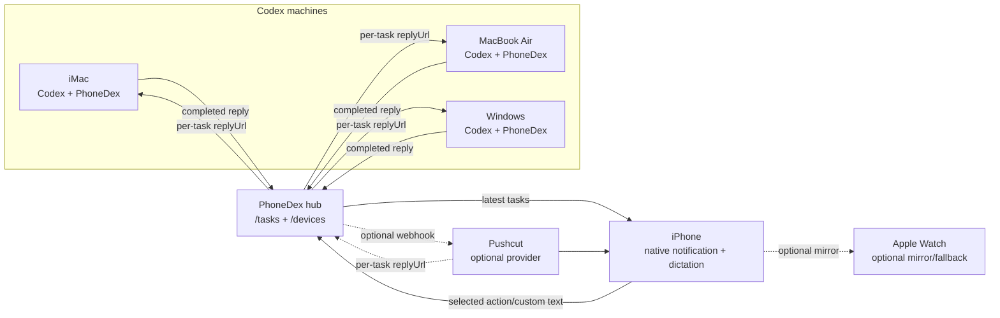
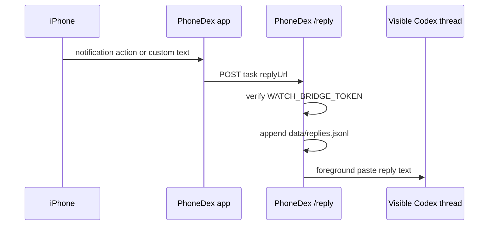

# PhoneDex Architecture

PhoneDex turns completed Codex replies into iPhone notifications, then routes a
phone reply back to the right Codex machine.

The versioned hub record contract is documented in
[`docs/protocol.md`](protocol.md). New task and device records carry their
schema identity while the current JSONL endpoints continue to accept legacy
records during migration.

The `/sync` contract negotiates protocol version 1 through an explicit request
header and returns the hub capability set. A device heartbeat carries both
legacy capability flags and versioned `capabilityDetails`; the iPhone uses the
latter to explain supported and unavailable actions rather than assuming Mac
and Windows adapters have the same controls. Unsupported protocol versions
return a visible compatibility error instead of being guessed or downgraded.

Task and device state is persisted through the versioned transactional store
in [`lib/phonedex-store.js`](../lib/phonedex-store.js). It atomically replaces
`phonedex-store.json`, retains the previous snapshot as
`phonedex-store.json.bak`, and imports the current JSONL/device files on first
start. Those legacy files remain mirrored for compatibility, while bridge
reads and task deduplication use the transactional snapshot as the source of
truth.

## Product Flow

The experience is intentionally simple:

1. Codex finishes a response on a computer.
2. PhoneDex notices the completed response.
3. PhoneDex stores the completion locally and forwards it to the hub when this
   machine is an agent.
4. The native PhoneDex iOS app fetches the task, or Pushcut delivers an
   optional webhook notification.
5. You expand the notification, read the result, then tap a canned action or
   type or dictate a custom reply.
6. The iPhone stores a task-version-bound reply command in its encrypted cache,
   then calls the originating machine's PhoneDex `/reply` endpoint with a
   stable idempotency key.
7. PhoneDex records the command and receipt, retries failed origin delivery
   without forwarding a completed command twice, and can paste the reply into
   the active Codex thread.


## System Topology



The PhoneDex hub stores the shared task stream and device status. Each Codex
machine still runs its own local PhoneDex bridge, because each machine owns its
local Codex sessions and foreground paste permissions.

The hub only knows the full device set when `PHONEDEX_EXPECTED_DEVICES` is
configured. `phonedex verify-devices` is the coverage gate: it exits nonzero
until every expected device is heartbeating as `online`.

## Completion Detection

PhoneDex has two completion paths:

| Path | Purpose | Why It Exists |
| --- | --- | --- |
| Codex `Stop` hook | Primary completion signal when Codex hooks fire. | Fast and direct when hook payloads are available. |
| Session watcher | Fallback scanner for Codex session JSONL files. | Catches completed replies when hooks are unavailable or stale. |

The session watcher polls recent files under `~/.codex/sessions`, waits a
short debounce period, then extracts final assistant text. It currently
understands older `response_item` final messages, `event_msg` records with
`payload.type = "task_complete"`, and final-answer `agent_message` records.

State lives in `data/session-watch-state.json`, so the watcher does not notify
the same completed reply repeatedly. Each capture also carries a deterministic
logical completion identity when the source device, Codex session, and message
identity are available. The hook and watcher use that identity to merge into
one durable task in either arrival order; merged provenance is retained as
bounded `captureSources`, while an unchanged duplicate does not create another
sync change or notification.

## Notification Build

When PhoneDex records a completion, it creates a task entry in
`data/tasks.jsonl`.

Each task stores:

- `id`: stable task id for reply matching
- `title`: notification title
- `text`: the Codex response preview
- `cwd`: project directory that produced the response
- `sessionId`: Codex session id when available
- `machineName`: human-readable source machine
- `logicalEventId`: stable completion identity when session/message metadata is
  available
- `captureSources`: bounded hook/watcher provenance for the same logical event

For the native iOS path, the app reads `/tasks`, schedules a local notification
with category `PHONEDEX_TASK`, and posts action replies back to `/reply`.
Pushcut can use the same task shape as an optional webhook fallback:

```json
{
  "taskId": "task_...",
  "choice": "okay_whats_next",
  "prompt": "okay whats next",
  "replyUrl": "http://192.168.1.189:8765/reply",
  "machineName": "MacBook Air",
  "token": "..."
}
```

That `replyUrl` is the multi-machine routing key. The notification carries the
callback URL that should receive the reply, so replies route back to the
machine and session that created the task. PhoneDex's native iOS path uses a
notification content extension so the expanded view can show a branded,
scrollable task surface like the README mockup.

## Phone Actions

The action set is intentionally small:

| Action | What It Sends |
| --- | --- |
| `Okay, what's next` | Literal foreground text: `okay whats next` |
| `Let's do that` | Literal foreground text: `lets do that` |
| `Custom reply` | Text from the native iPhone notification input, including dictation |

For background resume modes, PhoneDex can wrap canned choices in safer Codex
instructions. In foreground mode, the text is pasted literally into the visible
Codex thread so the current UI shows exactly what you tapped or typed.

Apple Watch can remain a secondary notification surface, but iPhone is the
primary custom text and dictation path.

## Reply Routing



The native app reads the task's `replyUrl` and posts the reply body to that
URL. This makes replies route back to the iMac, MacBook Air, or Windows
machine that created the notification.

## Auto-Resume Modes

PhoneDex has three ways to continue Codex from a phone reply:

| Mode | How It Works | Current Use |
| --- | --- | --- |
| `foreground` | Activates Codex.app, pastes the reply, presses Return. | Current preferred mode on Mac. |
| `app-server` | Uses Codex app-server to resume a session in the background. | Works, but does not render in the visible thread. |
| `cli` | Runs `codex exec resume <session> <prompt>`. | Useful fallback if CLI resume is enough. |

Foreground mode needs macOS Accessibility permission for the process running
PhoneDex, plus `osascript` when macOS prompts for it.

## Local Services

On this Mac, launchd keeps the core services running:

| Service | Role |
| --- | --- |
| `com.nash226.watchdex.bridge` | PhoneDex service with `/health`, `/reply`, `/tasks`, `/devices`, and the session watcher. |

That launchd label still uses `watchdex` as a legacy compatibility id. The
public CLI, docs, notification text, and npm package present the product as
PhoneDex.

The live bridge health endpoint returns the machine name and reply URL:

```json
{
  "ok": true,
  "service": "watchdex",
  "machineName": "MacBook Air",
  "publicUrl": "http://192.168.1.189:8765",
  "replyUrl": "http://192.168.1.189:8765/reply"
}
```

`service: "watchdex"` is retained for compatibility with already-installed
local services.

## Engineering Choices

The system is local-first. Codex sessions, replies, and logs stay on the
machine that generated them. The hub stores task metadata for configured
devices; Pushcut is only an optional webhook notification fallback.

The data model uses a versioned local store plus compatibility JSONL files. The
privacy control plane keeps the local-first deployment inspectable while
making retention and deletion explicit:

| File | Purpose |
| --- | --- |
| `data/tasks.jsonl` | Completed Codex replies and manual notification tasks. |
| `data/replies.jsonl` | Phone replies and custom text entries. |
| `data/events.jsonl` | Notification attempts and auto-resume events. |
| `data/session-watch-state.json` | Deduplication state for the session watcher. |
| `data/devices.json` | Latest heartbeat for each reporting PhoneDex service. |
| `data/privacy-policy.json` | Bounded retention policy. A missing policy is non-destructive. |
| `data/privacy-audit.jsonl` | Content-free retention and history-deletion audit entries. |

Security is handled with `WATCH_BRIDGE_TOKEN`. The token is verified by
`/reply`, `/tasks`, `/devices`, `/replies`, and the privacy endpoints when it
is set. Native app clients should send it as an authorization bearer token or
query parameter.

Authenticated `GET /privacy` and `GET /privacy/export` expose bounded policy
and redacted user data. `POST /privacy/retention` requires
`APPLY_PHONEDEX_RETENTION`; `POST /privacy/delete` requires
`DELETE_PHONEDEX_HISTORY`. Both controls are hub-owned and platform-neutral,
and deletion retains device inventory for recovery diagnostics.
Secrets live in `.env`, which is ignored by git.

## Multi-Machine Plan

The routing layer is ready. To add another computer:

1. Install PhoneDex on that computer.
2. Point it at the same PhoneDex hub with `PHONEDEX_HUB_URL`.
3. Set a unique `PHONEDEX_MACHINE_NAME`.
4. Set `WATCH_BRIDGE_PUBLIC_URL` to a URL the hub or phone can reach for that
   computer's reply callback.
5. Start the bridge and session watcher.

MacBook Air should follow the same path as this Mac. Windows can send
notifications once PhoneDex is installed there; foreground reply paste will
need a Windows-specific submitter or a working background Codex resume path.

## Current State

Working now:

- Completed Codex final replies notify the iPhone.
- Notifications include long response previews.
- Canned and custom replies return to Codex.
- iPhone dictation works through the native custom reply field.
- Foreground mode pastes the reply into the visible Codex thread.
- Notifications include machine name and per-task reply URL.
- PhoneDex routes replies back to the originating machine.
