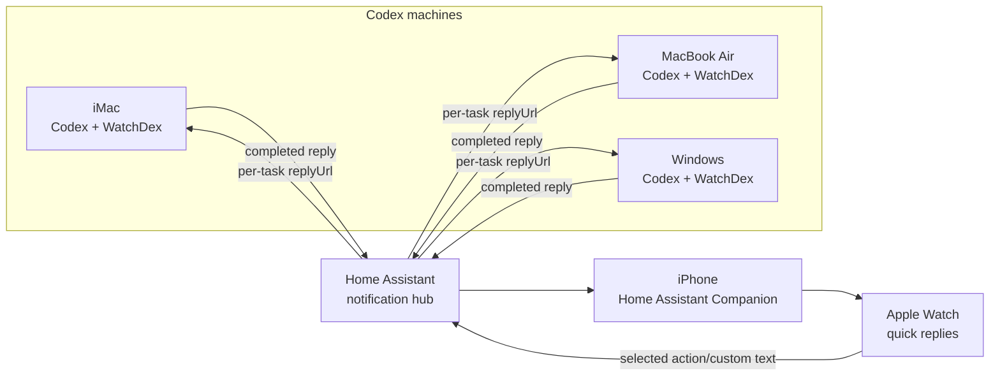
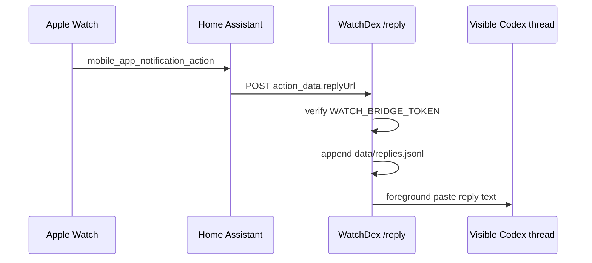

# WatchDex Architecture

WatchDex turns completed Codex replies into Apple Watch notifications, then
routes a wrist reply back to the right Codex machine.


## Product Flow

The experience is intentionally simple:

1. Codex finishes a response on a computer.
2. WatchDex notices the completed response.
3. WatchDex sends the completion text to Home Assistant.
4. Home Assistant delivers an actionable notification to iPhone and Apple Watch.
5. You scroll the result, then tap a canned action or enter a custom reply.
6. Home Assistant calls the originating machine's WatchDex `/reply` endpoint.
7. WatchDex records the reply and can paste it into the active Codex thread.


## System Topology



Home Assistant is the shared notification hub. Each Codex machine still runs
its own local WatchDex bridge, because each machine owns its local Codex
sessions and local foreground paste permissions.

## Completion Detection

WatchDex has two completion paths:

| Path | Purpose | Why It Exists |
| --- | --- | --- |
| Codex `Stop` hook | Primary completion signal when Codex hooks fire. | Fast and direct when hook payloads are available. |
| Session watcher | Fallback scanner for Codex session JSONL files. | Catches completed replies when hooks are unavailable or stale. |

The session watcher polls recent files under `~/.codex/sessions`, waits a short
debounce period, then extracts final assistant text. It currently understands
both older `response_item` final messages and newer `event_msg` records with
`payload.type = "task_complete"`.

State lives in `data/session-watch-state.json`, so the watcher does not notify
the same completed reply repeatedly.

## Notification Build

When WatchDex records a completion, it creates a task entry in
`data/tasks.jsonl`.

Each task stores:

- `id`: stable task id for reply matching
- `title`: notification title
- `text`: the Codex response preview
- `cwd`: project directory that produced the response
- `sessionId`: Codex session id when available
- `machineName`: human-readable source machine

For Home Assistant, WatchDex sends a `notify.mobile_app_*` service call with
action data attached to each button:

```json
{
  "taskId": "task_...",
  "choice": "okay_whats_next",
  "prompt": "okay whats next",
  "replyUrl": "http://192.168.1.189:8765/reply",
  "machineName": "Zimbas iMac",
  "token": "..."
}
```

That `replyUrl` is the multi-machine routing key. Home Assistant does not need
to know which computer owns the task ahead of time; the notification carries
the callback URL that should receive the reply.

## Watch Actions

The action set is intentionally small:

| Action | What It Sends |
| --- | --- |
| `Okay, what's next` | Literal foreground text: `okay whats next` |
| `Let's do that` | Literal foreground text: `lets do that` |
| `Custom reply` | Text from Home Assistant notification input, or dictated text from the Shortcuts fallback |

For background resume modes, WatchDex can wrap canned choices in safer Codex
instructions. In foreground mode, the text is pasted literally into the visible
Codex thread so the current UI shows exactly what you tapped or typed.

## Reply Routing



The Home Assistant automation receives
`mobile_app_notification_action`, reads `action_data.replyUrl`, and posts the
reply body to that URL. This makes replies route back to the iMac, MacBook Air,
or Windows machine that created the notification.

## Auto-Resume Modes

WatchDex has three ways to continue Codex from a Watch reply:

| Mode | How It Works | Current Use |
| --- | --- | --- |
| `foreground` | Activates Codex.app, pastes the reply, presses Return. | Current preferred mode on Mac. |
| `app-server` | Uses Codex app-server to resume a session in the background. | Works, but does not render in the visible thread. |
| `cli` | Runs `codex exec resume <session> <prompt>`. | Useful fallback if CLI resume is enough. |

Foreground mode needs macOS Accessibility permission for the process running
WatchDex, plus `osascript` when macOS prompts for it.

## Local Services

On this Mac, launchd keeps the core services running:

| Service | Role |
| --- | --- |
| `com.nash226.watchdex.bridge` | HTTP bridge with `/health`, `/reply`, `/tasks`, and `/replies`. |
| `com.nash226.watchdex.session-watch` | Polls Codex sessions and creates notification tasks. |
| `com.nash226.watchdex.homeassistant` | Local Home Assistant Core instance. |
| `com.nash226.watchdex.homeassistant-tunnel` | Temporary Cloudflare tunnel for remote Home Assistant access. |

The live bridge health endpoint now returns the machine name and reply URL:

```json
{
  "ok": true,
  "service": "watchdex",
  "machineName": "Zimbas iMac",
  "publicUrl": "http://192.168.1.189:8765",
  "replyUrl": "http://192.168.1.189:8765/reply"
}
```

## Engineering Choices

The system is local-first. Codex sessions, replies, and logs stay on the
machine that generated them. Home Assistant only acts as a notification and
routing hub.

The data model uses JSONL files instead of a database because the workflow is
append-only and easy to inspect:

| File | Purpose |
| --- | --- |
| `data/tasks.jsonl` | Completed Codex replies and manual notification tasks. |
| `data/replies.jsonl` | Watch replies and custom text entries. |
| `data/events.jsonl` | Notification attempts and auto-resume events. |
| `data/session-watch-state.json` | Deduplication state for the session watcher. |

Security is handled with `WATCH_BRIDGE_TOKEN`. The token is included in Home
Assistant action data and verified by `/reply`. Secrets live in `.env`, which
is ignored by git.

## Multi-Machine Plan

The routing layer is ready. To add another computer:

1. Install WatchDex on that computer.
2. Point it at the same Home Assistant instance.
3. Set a unique `WATCHDEX_MACHINE_NAME`.
4. Set `WATCH_BRIDGE_PUBLIC_URL` to a URL Home Assistant can reach for that
   computer.
5. Start the bridge and session watcher.

MacBook Air should follow the same path as this Mac. Windows can send
notifications once WatchDex is installed there; foreground reply paste will
need a Windows-specific submitter or a working background Codex resume path.

## Current State

Working now:

- Completed Codex final replies notify the Apple Watch.
- Notifications include long response previews.
- Canned and custom replies return to Codex.
- Foreground mode pastes the reply into the visible Codex thread.
- Notifications include machine name and per-task reply URL.
- Home Assistant routes replies back to the originating machine.

Still to build:

- MacBook Air install/bootstrap.
- Windows install/bootstrap.
- Windows foreground submitter, unless background Codex resume is sufficient.
- More durable remote URLs than temporary Cloudflare Quick Tunnel links.
