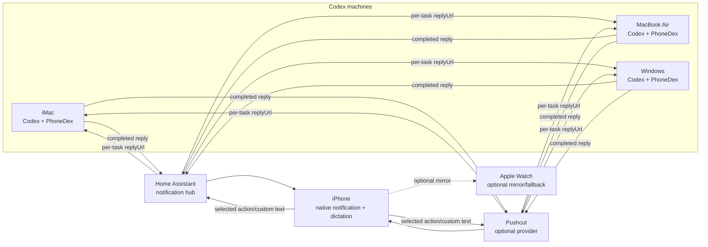
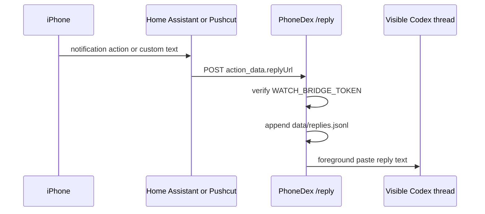

# PhoneDex Architecture

PhoneDex turns completed Codex replies into iPhone notifications, then routes a
phone reply back to the right Codex machine.

## Product Flow

The experience is intentionally simple:

1. Codex finishes a response on a computer.
2. PhoneDex notices the completed response.
3. PhoneDex sends the completion text to Home Assistant or Pushcut.
4. The provider delivers an actionable notification to iPhone.
5. You expand the notification, read the result, then tap a canned action or
   type or dictate a custom reply.
6. The provider calls the originating machine's PhoneDex `/reply` endpoint.
7. PhoneDex records the reply and can paste it into the active Codex thread.


## System Topology



Home Assistant or Pushcut acts as the notification hub. Each Codex machine
still runs its own local PhoneDex bridge, because each machine owns its local
Codex sessions and foreground paste permissions.

## Completion Detection

PhoneDex has two completion paths:

| Path | Purpose | Why It Exists |
| --- | --- | --- |
| Codex `Stop` hook | Primary completion signal when Codex hooks fire. | Fast and direct when hook payloads are available. |
| Session watcher | Fallback scanner for Codex session JSONL files. | Catches completed replies when hooks are unavailable or stale. |

The session watcher polls recent files under `~/.codex/sessions`, waits a
short debounce period, then extracts final assistant text. It currently
understands both older `response_item` final messages and newer `event_msg`
records with `payload.type = "task_complete"`.

State lives in `data/session-watch-state.json`, so the watcher does not notify
the same completed reply repeatedly.

## Notification Build

When PhoneDex records a completion, it creates a task entry in
`data/tasks.jsonl`.

Each task stores:

- `id`: stable task id for reply matching
- `title`: notification title
- `text`: the Codex response preview
- `cwd`: project directory that produced the response
- `sessionId`: Codex session id when available
- `machineName`: human-readable source machine

For Home Assistant, PhoneDex sends a `notify.mobile_app_*` service call with
action data attached to each button:

```json
{
  "taskId": "task_...",
  "choice": "okay_whats_next",
  "prompt": "okay whats next",
  "replyUrl": "http://192.168.1.189:8765/reply",
  "machineName": "MacBook Air",
  "token": "..."
}
```

That `replyUrl` is the multi-machine routing key. Home Assistant does not need
to know which computer owns the task ahead of time; the notification carries
the callback URL that should receive the reply.

Home Assistant notifications include the full Codex output as the message and
as the long-form `subject` field. The notification tap target is set to
`noAction` so the phone stays in the native notification surface instead of
opening a browser page.

## Phone Actions

The action set is intentionally small:

| Action | What It Sends |
| --- | --- |
| `Okay, what's next` | Literal foreground text: `okay whats next` |
| `Let's do that` | Literal foreground text: `lets do that` |
| `Custom reply` | Text from Home Assistant notification input, including iPhone dictation |

For background resume modes, PhoneDex can wrap canned choices in safer Codex
instructions. In foreground mode, the text is pasted literally into the visible
Codex thread so the current UI shows exactly what you tapped or typed.

Apple Watch can remain a secondary notification surface, but iPhone is the
primary custom text and dictation path.

## Reply Routing



The Home Assistant automation receives `mobile_app_notification_action`, reads
`action_data.replyUrl`, and posts the reply body to that URL. This makes
replies route back to the iMac, MacBook Air, or Windows machine that created
the notification.

## Auto-Resume Modes

PhoneDex has three ways to continue Codex from a phone reply:

| Mode | How It Works | Current Use |
| --- | --- | --- |
| `foreground` | Activates Codex.app, pastes the reply, presses Return. | Current preferred mode on Mac. |
| `app-server` | Uses Codex app-server to resume a session in the background. | Works, but does not render in the visible thread. |
| `cli` | Runs `codex exec resume <session> <prompt>`. | Useful fallback if CLI resume is enough. |

Foreground mode needs macOS Accessibility permission for the process running
PhoneDex, plus `osascript` when macOS prompts for it.

## Local Services

On this Mac, launchd keeps the core services running:

| Service | Role |
| --- | --- |
| `com.nash226.watchdex.bridge` | HTTP bridge with `/health`, `/reply`, `/tasks`, and `/replies`. |
| `com.nash226.watchdex.session-watch` | Polls Codex sessions and creates notification tasks. |
| `com.nash226.watchdex.homeassistant` | Local Home Assistant Core instance. |
| `com.nash226.watchdex.homeassistant-tunnel` | Temporary Cloudflare tunnel for remote Home Assistant access. |

Those launchd labels still use `watchdex` as legacy compatibility ids. The
public CLI, docs, notification text, and npm package now present the product as
PhoneDex.

The live bridge health endpoint returns the machine name and reply URL:

```json
{
  "ok": true,
  "service": "watchdex",
  "machineName": "MacBook Air",
  "publicUrl": "http://192.168.1.189:8765",
  "replyUrl": "http://192.168.1.189:8765/reply"
}
```

`service: "watchdex"` is retained for compatibility with already-installed
local services.

## Engineering Choices

The system is local-first. Codex sessions, replies, and logs stay on the
machine that generated them. Home Assistant and Pushcut only act as
notification and routing hubs.

The data model uses JSONL files instead of a database because the workflow is
append-only and easy to inspect:

| File | Purpose |
| --- | --- |
| `data/tasks.jsonl` | Completed Codex replies and manual notification tasks. |
| `data/replies.jsonl` | Phone replies and custom text entries. |
| `data/events.jsonl` | Notification attempts and auto-resume events. |
| `data/session-watch-state.json` | Deduplication state for the session watcher. |

Security is handled with `WATCH_BRIDGE_TOKEN`. The token is included in Home
Assistant action data and verified by `/reply`. Secrets live in `.env`, which
is ignored by git.

## Multi-Machine Plan

The routing layer is ready. To add another computer:

1. Install PhoneDex on that computer.
2. Point it at the same Home Assistant instance or Pushcut setup.
3. Set a unique `PHONEDEX_MACHINE_NAME`.
4. Set `WATCH_BRIDGE_PUBLIC_URL` to a URL the provider can reach for that
   computer.
5. Start the bridge and session watcher.

MacBook Air should follow the same path as this Mac. Windows can send
notifications once PhoneDex is installed there; foreground reply paste will
need a Windows-specific submitter or a working background Codex resume path.

## Current State

Working now:

- Completed Codex final replies notify the iPhone.
- Notifications include long response previews.
- Canned and custom replies return to Codex.
- iPhone dictation works through the native custom reply field.
- Foreground mode pastes the reply into the visible Codex thread.
- Notifications include machine name and per-task reply URL.
- Home Assistant routes replies back to the originating machine.
